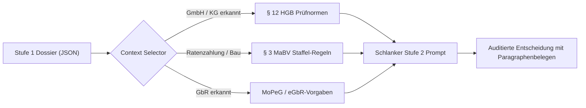
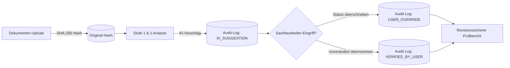
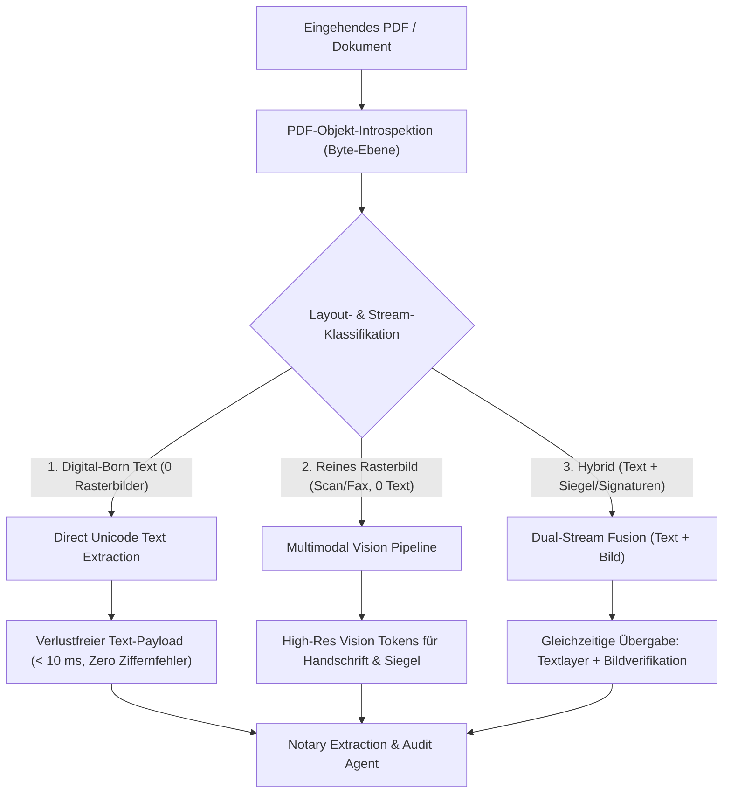
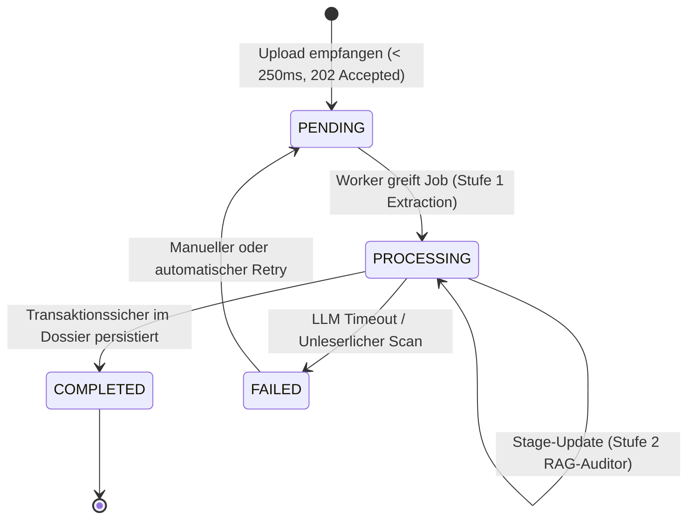
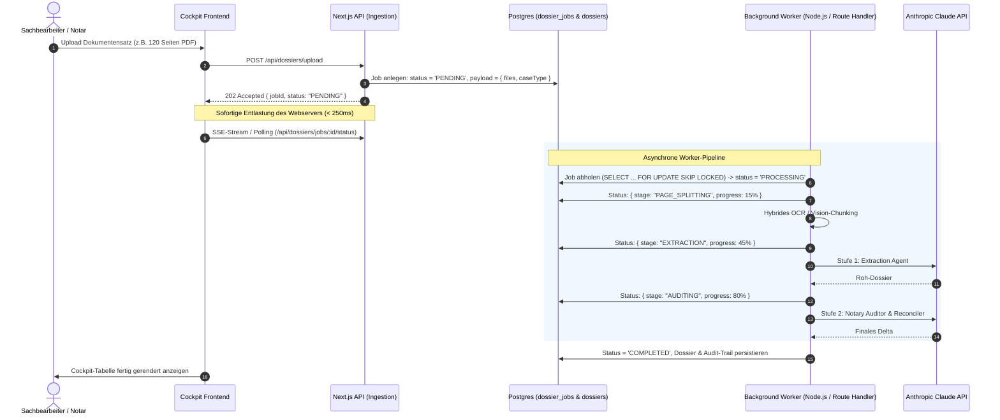
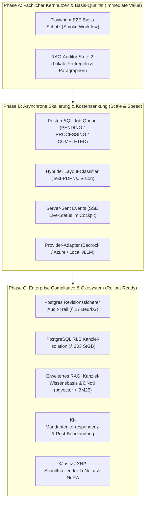

# Architektur-Roadmap für den skalierenden Live-Betrieb (Notariat 24/7)

> **Dokumentstatus:** Zentrale Architektur-Spezifikation für die Produktivüberführung (Single Source of Truth)  
> **Bezugssystem:** NotarPartner Urkunden-Zuarbeit (Next.js 16, TypeScript, Claude Vision, Supabase)

---

## 1. Executive Summary: Vom Prototyp zum Enterprise-Kanzleisystem

Der vorliegende Prototyp beweist die fachliche Machbarkeit: Heterogene Urkundensätze werden über einen 2-stufigen Agenten-Workflow (Extraction + Notary Auditor) rechtssicher, auditierbar und mit Human-in-the-Loop aufbereitet.

Für den **Produktivbetrieb in Notariaten** mit täglichen Lastspitzen, Großaktenbänden (50–200 Seiten), strengsten Berufsgeheimnis-Vorgaben (§ 203 StGB / § 18 BNotO) und dem Anspruch auf echte Arbeitserleichterung im Kanzleialltag definiert dieses Dokument die Kernsäulen der Ziel-Architektur sowie einen nach **technischem ROI und Abhängigkeiten priorisierten Phasenplan**:

1. **Fachliche Kern-Module:** RAG-gestützter Auditor, automatisierte Mandantenkorrespondenz und Post-Beurkundungsvollzug (Word-Urkundengenerierung optional / siehe Additions).
2. **Qualitäts-Fundament & Kanzlei-Compliance:** Playwright E2E-Automation, revisionssicherer Audit-Trail & Zero-Data-Retention (ZDR).
3. **Provider-Flexibilität & Kostensenkung:** Multi-LLM Adapter (Bedrock, Azure, Local vLLM) und hybrides OCR/Vision-Pre-Filtering (60–75 % Ersparnis).
4. **Asynchrone Hintergrundverarbeitung:** PostgreSQL-basierte Job-Queue (`dossier_jobs` mit PENDING/PROCESSING/COMPLETED/FAILED) zur Beseitigung von HTTP-Timeouts bei Großakten mit Live-Status (SSE).
5. **Mandantenfähigkeit & Kanzlei-Isolation:** PostgreSQL Row-Level Security (RLS) zur hermetischen Trennung fremder Kanzleidaten (§ 203 StGB).
6. **Ökosystem & Fachverfahren:** Standardisierter XJustiz- / XNP-Export zur medienbruchfreien Integration in TriNotar, NoRA, Notar 4.0 und RA-MICRO sowie Rechtsgebiets-Expansion.

---

## 2. Fachliche Kern-Module (The Notary Core)

### 2.1 RAG-gestützter Notary Auditor (Stufe-2-Optimierung)

- **Zielkomponente:** `Notary Auditor & Reconciler` in `src/app/api/analyze/route.ts`
- **Kernnutzen:** **70–90 % Token-Ersparnis**, maximale **Deterministik** und rechtssichere Begründungen mit Paragraphenbelegen.

#### Problem im Status Quo

Aktuell prüft Stufe 2 mit statischen Faustregeln im Prompt (z. B. 10 Jahre GEG, § 21 BeurkG).

- **Prompt-Bloat:** Sondergesetze (MoPeG für GbRs, MaBV-Raten, Sanierungsvermerke nach § 144 BauGB) können nicht alle statisch im Prompt stehen, ohne Token-Kosten und Kontextgrenzen zu sprengen.
- **Ungenaue Nachforderungen:** Fehlen Belege, moniert das System oft generisch (_„Vollmacht fehlt“_ statt _„Registerauszug gem. § 12 HGB nötig“_).

#### Lösung: Deterministisches Just-in-Time Retrieval

Statt eines unübersehbaren „Mega-Prompts“ holt sich Stufe 2 **nur die Regeln, die zum konkreten Fall passen**:



#### Wissensbasis (3 Säulen)

1. **Gesetzliche Prüfnormen:** BGB, BeurkG, GBO, GEG (10-Jahres-Frist), MaBV, HGB.
2. **Kanzlei-Standards:** Interne Checklisten nach Vorgangstyp (Gewerbekauf, Überlassung, WEG).
3. **Zwischenverfügungs-Prävention:** Historische Beanstandungen lokaler Grundbuchämter (z. B. Klauselerfordernisse spezifischer Amtsgerichte).

#### Phasenweise Umsetzung

- **Phase 1 (Quick Win):** [x] **Fertiggestellt & Verifiziert** — Lokale strukturierte Checklisten in `src/lib/knowledge/rules/` (`rules-registry.ts`, `rule-selector.ts`), deterministisch in Stufe 2 Prompt injiziert (`pipeline.ts`) mit 100 % Unit-Test-Abdeckung (`rule-selector.test.ts`).
- **Phase 2 (Erweitert):** [ ] Hybrid Search (BM25 für Paragraphen + `pgvector` in Supabase) für Kanzleisammlungen und DNotI-Gutachten.
- **Phase 3 (Enterprise):** [ ] Mandantenisolierte Kanzlei-Wissensbasis mit PostgreSQL Row-Level Security (§ 18 BNotO / § 203 StGB).

---

### 2.2 Word-Urkunden-Engine (Ausgelagert ins Backlog)

> **Hinweis:** Dieser Baustein wurde als nachgelagertes/optionales Feature eingestuft und in [ARCHITECTURE_ROADMAP_ADDITIONS.md](./ARCHITECTURE_ROADMAP_ADDITIONS.md) archiviert. Der Fokus liegt primär auf rechtssicherer Prüfung, Konsistenz-Audit und asynchroner Großakten-Verarbeitung.

---

### 2.3 KI-Mandantenkorrespondenz & Entwurfsversand

- **Ziel:** Automatisierte, individuelle Begleitschreiben und Entwurfs-E-Mails an Mandanten, Makler und Banken (Schritt 03 auf beta.notarpartner.de).
- **Rechtssichere Hinweise:** Schreiben werden dynamisch aus dem Dossier generiert (z. B. konkreter Hinweis an den Käufer auf die gesetzliche 14-tägige BGB-Verbraucherprüffrist gem. § 17 Abs. 2a BeurkG).
- **Automatisierter Adressaten-Filter:**
  - _An Käufer/Verkäufer:_ Verständliche Erläuterung der nächsten Schritte (Fälligkeitsvoraussetzungen, Übergabe).
  - _An finanzierende Bank:_ Gezielte Übersendung des Grundschuldentwurfs mit Treuhandauflagen-Bestätigung.
- **Audit-Konnexität:** Revisionssichere Archivierung aller versendeten Entwürfe und Begleitschreiben.

---

### 2.4 Beschleunigte Abwicklung & Vollzug (Post-Beurkundung)

- **Ziel:** Automatisierung der Nachbereitungs- und Vollzugsphase nach der Beurkundung (Schritt 04 auf beta.notarpartner.de).
- **Automatisierte Behörden- & Vollzugssätze auf Knopfdruck:**
  - **Grundbuchamt:** Anträge auf Eigentumsvormerkung, Eigentumsumschreibung und Grundschuldeintragung.
  - **Gemeinde / Finanzamt:** Anforderung der Vorkaufsrechtsverzichtserklärung (§ 28 BauGB) und Unbedenklichkeitsbescheinigung.
  - **Fälligkeitsmitteilung:** Präzise Berechnung von Zahlungsziel, Bank-IBANs und Treuhandabzügen nach Eintritt aller Voraussetzungen.

---

## 3. Qualitäts-Fundament & Kanzlei-Compliance (Test-First)

### 3.1 Vollständige E2E-Testsuite mit Playwright

Bevor infrastrukturelle Umbauten anstehen, sichert eine Ende-zu-Ende-Testsuite das Kernverhalten des Sachbearbeiter-Workflows ab:

1. **Upload großer Aktenpakete:**
   - Multi-File-Drag-and-Drop (6–10 PDFs gleichzeitig) unter realistischen Netzwerkbedingungen.
2. **Kollaboratives Human-in-the-Loop:**
   - Simuliertes Überschreiben eines Feldwertes durch den Sachbearbeiter (z. B. manueller Status-Wechsel von `NEEDS_REVIEW` auf `VERIFIED`).
   - Verifikation, dass manuelle Korrekturen den Audit-Trail nicht beschädigen.
3. **Barrierefreiheit & Keyboard-Navigation:**
   - Volle Bedienbarkeit der Cockpit-Tabelle via Tastatur (WCAG 2.1 AA Konformität für Kanzleiarbeitsplätze).
4. **UI/UX-Polishing & Responsiveness:**
   - Überführung der prototypischen Oberfläche in ein voll ausgereiftes Kanzlei-Designsystem (Abstände, Ladezustände, Feedback-Banner, Begleitansicht).

### 3.2 Revisionssicherer Kanzlei-Audit-Trail & Beweissicherung (§ 17 ff. BeurkG)

Da der Notar persönlich für den Urkundeninhalt haftet, protokolliert eine Append-Only-Tabelle in PostgreSQL gerichtsfest jeden Bearbeitungsschritt:



- **Inhalt jedes Audit-Eintrags:**
  - Zeitstempel (UTC ISO-8601), User-ID und Kanzlei-ID.
  - Betroffenes Feld (`fieldKey`) sowie Vorher-/Nachher-Zustand.
  - Zwingende Pflichtbegründung bei manuellem Überschreiben von Warnungen (`NEEDS_REVIEW` -> `VERIFIED`).
  - SHA-256-Fingerprint der zugrundeliegenden Quelldatei.

### 3.3 Zero-Data-Retention (ZDR) Vertragskonfiguration (Ausgelagert ins Backlog)

> _Hinweis: Die vertragliche Konfiguration von ZDR-Vereinbarungen (Cloud Contractual mit Anthropic / AWS / Google Cloud) wurde ins Backlog ausgelagert (siehe [ARCHITECTURE_ROADMAP_ADDITIONS.md](./ARCHITECTURE_ROADMAP_ADDITIONS.md)). Der technische Revisionsschutz ist durch Phase C.1 (Append-Only Audit-Trail) vollständig realisiert._

---

## 4. Ingestion-Pipeline & Zeichenintegrität

> _Hinweis: Das Thema Multi-LLM Provider-Adapter (AWS Bedrock / Azure / vLLM) wurde ins Backlog ausgelagert (siehe [ARCHITECTURE_ROADMAP_ADDITIONS.md](./ARCHITECTURE_ROADMAP_ADDITIONS.md))._

### 4.1 Dual-Stream Ingestion Pipeline (Industriestandard für Zeichenintegrität & Vision)

> **Architektur-Spezifikation (Dual-Stream / Hybrid Ingestion):**  
> Der Einsatz einer hybriden Pipeline dient im Notariat **primär der absoluten Zeichenpräzision (Zero OCR-Tippfehler bei Kaufpreisen, IBANs und Flurstücken)** sowie sekundär der Geschwindigkeits- und Durchsatzoptimierung:
>
> - **1. Digital-Born PDF (Reiner Textlayer, keine Rasterbilder):** Extrahiert den Unicode-Text direkt verlustfrei (< 10 ms). Mathematisch ausgeschlossene Fehlinterpretationen bei sensiblen Ziffernfolgen (`1.250.000 €`, `HRB 20459`, `Flur 12, Flurstück 108/4`).
> - **2. Scans / Bildträger (Reine Bildseiten, kein Text):** Multimodales Vision-Routing (Gemini 3.x Flash / Claude Vision) für unübertroffenes Kontextverständnis bei Handschriften, Siegeln und Stempeln.
> - **3. Hybride Dokumente (Digitaler Text + eingescannte Siegel/Signaturen):** Dual-Stream Fusion – Übergabe sowohl des exakten Unicode-Textlayers als auch der Bild-Payloads an das Modell mit striktem Abgleich.



- **Effekt:** 100 % mathematische Zeichenexaktheit bei Urkundendaten, maximale Ausfallsicherheit bei Stempeln/Handschriften und drastisch schnellere Verarbeitung digitaler Entwürfe.

---

## 5. Asynchrone Hintergrundverarbeitung (PostgreSQL Job-Queue)

### 5.1 Problemstellung im Kanzleialltag

| Problem                      | Auswirkung ohne Queue (Synchron)                                                                                             | Lösung mit PostgreSQL-Queue (`dossier_jobs`)                                                                                        |
| :--------------------------- | :--------------------------------------------------------------------------------------------------------------------------- | :---------------------------------------------------------------------------------------------------------------------------------- |
| **HTTP-Timeouts**            | Proxies (Cloudflare/Nginx/Vercel) kappen Verbindungen nach 30–60 s. Ein 100-Seiten-Lauf bricht mit `504 Gateway Timeout` ab. | Der HTTP-Upload antwortet in **< 250 ms** mit `202 Accepted` (`status: PENDING`). Die Verarbeitung läuft entkoppelt im Hintergrund. |
| **Tab-Schließung / Abbruch** | Sachbearbeiter schließt das Browser-Fenster -> Lauf bricht ab, teure LLM-Tokens sind verbrannt.                              | Jobs persistieren transaktionssicher in Postgres; der Sachbearbeiter kann den Rechner wechseln oder herunterfahren.                 |
| **Peak-Load & Rate Limits**  | Wenn morgens um 09:00 Uhr 8 Mitarbeiter gleichzeitig Akten hochladen, drohen `429 Rate Limits` oder RAM-Crash.               | **Concurrency Control:** Worker greift Jobs gezielt via `FOR UPDATE SKIP LOCKED`; Überhang wartet geordnet im Status `PENDING`.     |
| **Transiente API-Fehler**    | KI-Server überlastet (`529 Overloaded`) -> Vorgang scheitert.                                                                | Automatischer **Retry-Zähler** im Job-Record mit markiertem `FAILED`-Status und präziser Fehlerursache.                             |

### 5.2 Technisches Design & Job-Lifecycle





### 5.3 Produktionsfester Worker-Lifecycle & Ausfallsicherheit (Daemon & Orphan Recovery)

Im Prototyp wird die Hintergrundverarbeitung über `void executeDossierJob(job.id)` im Next.js-Prozess angestoßen. Für den 24/7-Kanzleibetrieb erfordert dies eine robuste Entkopplung:

1. **Eigenständiger Worker-Daemon (Decoupled Runner):**
   - Entkopplung vom Next.js-Web-Container in einen dedizierten Node.js-Worker-Prozess (oder systemd/Docker-Container).
   - Sauberes **Graceful Shutdown (`SIGTERM`/`SIGINT`)**: Laufende LLM-Pipelines erhalten ein Abbruchsignal (AbortController); der Job-Status wird geordnet auf `PENDING` zurückgesetzt statt zerstört zu werden.
2. **Orphan-Job Recovery & Lease-Timeout (Zombie-Sweeper):**
   - Stürzt ein Worker-Container während einer laufenden Analyse unerwartet ab (z. B. Out-of-Memory oder VM-Neustart), bleibt der Job nicht dauerhaft auf `PROCESSING` blockiert.
   - Ein periodischer Sweeper prüft `locked_at`: Ist ein Job länger als das konfigurierte Lease-Timeout (z. B. 5 Minuten) im Status `PROCESSING` ohne Lebenszeichen, wird er automatisch zur Wiederholung freigegeben (`status = 'PENDING'`, Retry-Zähler erhöht) oder nach 3 Fehlversuchen als `FAILED` markiert.

---

## 6. Mandantenfähigkeit (Multi-Tenancy) & Kanzlei-Isolation (§ 203 StGB)

### 6.1 Das berufsrechtliche Gebot der strikten Trennung

Notariate unterliegen der berufsrechtlichen Verschwiegenheitspflicht (§ 18 BNotO) und dem strafbewehrten Berufsgeheimnis (§ 203 StGB). In einem mandantenfähigen Cloud-Setup darf unter keinen Umständen ein Datenabfluss zwischen verschiedenen Kanzleien (Tenants) oder innerhalb einer Sozietät bei Mandatskonflikten möglich sein.

### 6.2 Technisches Design: Row-Level Security (RLS) in PostgreSQL

Statt die Mandantentrennung fehleranfällig im Applikationscode zu verwalten, setzt die Ziel-Architektur auf **PostgreSQL Row-Level Security (RLS)** auf Datenbank-Kernel-Ebene:

```sql
ALTER TABLE dossiers ENABLE ROW LEVEL SECURITY;
ALTER TABLE documents ENABLE ROW LEVEL SECURITY;
ALTER TABLE audit_logs ENABLE ROW LEVEL SECURITY;
ALTER TABLE dossier_jobs ENABLE ROW LEVEL SECURITY;

CREATE POLICY tenant_isolation_policy ON dossiers
  FOR ALL
  USING (organization_id = current_setting('app.current_organization_id', true)::uuid);
```

### 6.3 Reproduzierbares Migrations- & Index-Management (Postgres & Supabase)

Für verlässliche CI/CD-Deployments und performante Datenbankabfragen bei wachsenden Kanzleiarchiven:

1. **Versionierte Migrationen (`supabase/migrations/`):**
   - Sämtliche Tabellen (`documents`, `audit_logs`, `dossier_jobs`), Enums und RLS-Policies werden deklarativ versioniert verwaltet und automatisiert über CI angewendet.
2. **Index-Strategie:**
   - `audit_logs`: B-Tree auf `(document_id, sequence_number)` zur schnellen kryptografischen Kettenprüfung.
   - `dossier_jobs`: Partieller Index auf `(status, created_at) WHERE status = 'PENDING'` für extrem schnelles Queue-Polling via `FOR UPDATE SKIP LOCKED`.
3. **Connection Pooling & Pooling-Port:**
   - Trennung zwischen Transaction-Pooler (Supavisor / PgBouncer Port 6543) für transiente Queue- und Audit-Writes und Session-Modus für Migrationen.

### 6.4 Rollen- und Rechtematrix (Kanzlei-RBAC)

| Rolle                                        | Berechtigungen im System                                                                                                                                    |
| :------------------------------------------- | :---------------------------------------------------------------------------------------------------------------------------------------------------------- |
| **Notar / Notarassessor**                    | Vollzugriff: Letztentscheidung über Freigaben, finale Status-Overrides, Export in Fachverfahren, Einsicht in unveränderliche Audit-Logs.                    |
| **Notarfachangestellte(r) / Sachbearbeiter** | Operativer Zugriff: Akten-Upload, Klärung von `NEEDS_REVIEW`, Einpflegen von Notizen und Nachträgen, Vorbereitung des Prüfberichts.                         |
| **Rechtsanwalt / Partner (Anwaltsnotariat)** | Selektiver Zugriff: Nur Einsicht in Akten, bei denen kein Mandatskonflikt vorliegt.                                                                         |
| **Kanzlei-Administrator**                    | Technischer Zugriff: Nutzerverwaltung, API-Schlüssel-Konfiguration (ZDR), Schnittstellenanbindung – **kein** Einblick in Mandantenakten ohne Audit-Eintrag. |

---

## 7. Ökosystem, Fachverfahren & Rechtsgebiets-Expansion

### 7.1 Fachverfahren- & Notarnetz-Integration

Der NotarPartner-Prototyp darf im Produktivbetrieb kein isoliertes Datensilo sein, sondern muss sich nahtlos in die bestehende Kanzlei-IT einfügen:

1. **XJustiz / XNP Standard-Export:**
   - Export der validierten Stammdaten (Beteiligte, Liegenschaften, Belastungen) im offiziellen **XJustiz-Standard (XML/JSON)**.
   - Direkter Import in marktführende Notariatsfachverfahren: **TriNotar**, **NoRA Advanced**, **Notar 4.0**, **RA-MICRO**.
2. **EGVP / Notarnetz-Konnexität:**
   - Vorbereitung für die sichere Übertragung über das Elektronische Gerichts- und Verwaltungspostfach (EGVP) und die Bundesnotarkammer-Infrastruktur.

### 7.2 Erweiterung auf weitere notarielle Rechtsgebiete

Über die discriminated Union `CaseType` und die dynamische Cockpit-Registry werden weitere Urkundentypen abgewickelt:

1. **Gesellschaftsrecht (`GMBH_GRUENDUNG`, Handelsregister):**
   - _Pflichtfelder:_ Gesellschafterliste, Stammkapital & Geschäftsanteile, Geschäftsführung & Vertretungsmacht, Satzung / Musterprotokoll, Gründungsvollmachten.
2. **Erbrecht & Nachlass (`ERBSCHEIN_TESTAMENT`):**
   - _Pflichtfelder:_ Erblasser & Sterbedatum, gesetzliche/gewillkürte Erbfolge, Erbenquoten, letztwillige Verfügungen, Pflichtteilsverzichtserklärungen.
3. **Familienrecht (`EHEVERTRAG_SCHIED`):**
   - _Pflichtfelder:_ Güterstand (Gütertrennung / Modifizierte Zugewinngemeinschaft), Unterhaltsvereinbarungen, Versorgungsausgleich.

---

## 8. Priorisierter Umsetzungs- und Phasenplan (Value & Dependency Driven)

Statt einer starren Nummerierung folgt die Umsetzung einem logischen **3-Stufen-Modell**: erst maximale Fachqualität & Sofort-Nutzen für Kanzleien, dann asynchrone Skalierung für Großakten, abschließend Enterprise-Kanzlei-Compliance vor dem breiten Rollout.



### Übersicht der Phasen & Umsetzungsstatus

| Phase       | Fokus                              | Hauptziel                                                    | Kern-Ergebnisse & Status                                                                                                                                                                                                                                                                                                                                        |
| :---------- | :--------------------------------- | :----------------------------------------------------------- | :-------------------------------------------------------------------------------------------------------------------------------------------------------------------------------------------------------------------------------------------------------------------------------------------------------------------------------------------------------------- |
| **Phase A** | **Fachlicher Kernnutzen**          | Sofortiger Mehrwert für Notare & Fehlerschutz                | • [x] **A.1 Basisschutz des UI-Flows via Playwright**<br>• [x] **A.2 RAG-Prüfregeln (JIT-Retrieval in Stufe 2)**<br>_(A.3 `.docx`-Engine ins Backlog ausgelagert)_                                                                                                                                                                                              |
| **Phase B** | **Skalierung & Resilienz**         | Stabilität bei Aktenbänden (50–200 Seiten) & Kostenkontrolle | • [x] **B.1 PostgreSQL Job-Queue (`dossier_jobs` mit PENDING/PROCESSING/COMPLETED/FAILED)**<br>• [x] **B.2 Dual-Stream Ingestion (Unicode-Text für Ziffernintegrität + Vision-Fusion)**<br>• [x] **B.3 SSE-Streaming von Teilfortschritten ins Cockpit**<br>• [x] **B.4 Entkoppelter Worker-Daemon & Zombie-Sweeper**<br>• [ ] B.5 Multi-LLM Provider-Adapter   |
| **Phase C** | **Enterprise & Kanzlei-Ökosystem** | Rechtliche Abnahme & Kanzlei-IT-Integration                  | • [x] **C.1 Append-Only Audit-Trail & Beweissicherung (§ 17 ff. BeurkG)**<br>• [x] **C.2 PostgreSQL RLS Mandantentrennung & Migration-Management (§ 203 StGB)**<br>• [x] **C.3 Erweitertes Kanzlei- & DNotI-RAG (pgvector + BM25 Hybrid)**<br>• [ ] C.4 KI-Mandantenkorrespondenz & Post-Beurkundung<br>• [ ] C.5 XJustiz-Export für TriNotar / NoRA / RA-MICRO |

### Detaillierter Fortschrittstracker (Phase A)

- [x] **Architektur-Fundament & Guardrails:**
  - [x] Separation of Policy and Mechanism (Materielle Rechtsregeln in `src/lib/knowledge/`, technischer Mechanismus in `src/lib/dossier/`)
  - [x] Dependency-Cruiser Invarianten (`domain-must-not-depend-on-ui`, `hooks-must-not-depend-on-ui`)
  - [x] ESLint AST Invariante gegen ungemergte Template-Strings in `className`
  - [x] Typsichere Dictionaries statt Magic Strings (`CASE_TYPES`, `FIELD_STATUS`, `CASE_STATUS`, `STATUS_LABELS_DE`)
- [x] **A.2 RAG-Auditor (JIT Rule Retrieval):**
  - [x] Typisierte Regel-Registry (`rules-registry.ts`) für GEG, BeurkG, HGB, GBO, BGB, BauGB
  - [x] Deterministischer JIT-Selektor (`rule-selector.ts`) nach Merkmalen aus Stufe 1
  - [x] Pipeline-Injektion in Stufe 2 Prompt (`pipeline.ts`)
  - [x] Unit-Test Suite mit 100 % Abdeckung (`rule-selector.test.ts`)
- [x] **A.1 Playwright E2E Basis-Schutz:**
  - [x] Smoke-Test Workflow (Dokument-Upload $\rightarrow$ Stepper $\rightarrow$ FieldCockpit-Tabelle $\rightarrow$ Status-Override $\rightarrow$ Export) in `e2e/smoke-workflow.spec.ts`
  - [x] Synthetische Urkunden-Fixtures in `e2e/fixtures/test-files.ts`
  - [x] Playwright-Konfiguration mit WebServer-Integration & Chromium Browser (`playwright.config.ts`, `npm run test:e2e`)
- [ ] **A.3 Word-Urkunden-Engine (`.docx`):**
  - _Ausgelagert ins Backlog / siehe [ARCHITECTURE_ROADMAP_ADDITIONS.md](./ARCHITECTURE_ROADMAP_ADDITIONS.md)_

### Detaillierter Fortschrittstracker (Phase B: Asynchrone Skalierung)

- [x] **B.1 PostgreSQL Job-Queue (`dossier_jobs`):**
  - [x] Zod-Schema & TypeScript-Typen für Job-Lebenszyklus (`PENDING`, `PROCESSING`, `COMPLETED`, `FAILED`) und Zwischen-Stages (`src/types/jobs.ts`, `src/types/jobs.test.ts`)
  - [x] Bounded In-Memory- & Supabase-Job-Repository mit Concurrency-Claim & TTL-Pruning (`job-repository.ts`, `job-repository.test.ts`)
  - [x] API-Adapter: `POST /api/analyze` unterstützt asynchrone Annahme via `?async=true` (`202 Accepted` & `jobId`), `GET /api/jobs/[id]`, `GET /api/jobs` & Retry via `POST /api/jobs` (`jobs-route.test.ts`, `jobs-list-route.test.ts`)
  - [x] Worker-Verarbeitungslogik mit Concurrency-Limiter (max. 2 parallele LLM-Jobs gegen 429) & State-Updates (`job-worker.ts`, `job-worker.test.ts`)
  - [x] UI-Integration in `DocumentTable` & Cockpit (Live-Kachel für Hintergrundprüfungen, dynamischer Progress-Balken, A11y, 1-Click Retry bei Fehlern)
- [x] **B.2 Dual-Stream Ingestion Pipeline (Zeichengenauigkeit & Vision):**
  - [x] Introspektion & Klassifikation auf Byte-Ebene (`pdf-stream-classifier.ts`) in Text, Scan oder Hybrid
  - [x] Verlustfreie Extraktion des Unicode-Textlayers (`pdf-text-extractor.ts`)
  - [x] Dual-Stream Payload-Assembler in `pipeline.ts` (Textlayer für Ziffern/Beträge + Vision-Bilder für Siegel/Handschriften)
  - [x] TDD-Unit-Tests für Klassifikation, Text-Integrität und Edge Cases (`pdf-stream-classifier.test.ts`, `pdf-text-extractor.test.ts`)
- [x] **B.3 SSE-Streaming von Teilfortschritten ins Cockpit**
- [x] **B.4 Entkoppelter Worker-Daemon & Zombie-Sweeper:**
  - [x] Eigenständiger Node.js-Worker-Runner mit Graceful Shutdown (`SIGTERM`/`SIGINT`)
  - [x] Periodischer Orphan-Recovery-Sweeper (Reaktivierung verwaister `PROCESSING`-Jobs nach Lease-Timeout)
- [ ] **B.5 Multi-LLM Provider-Adapter**

### Detaillierter Fortschrittstracker (Phase C: Enterprise Compliance & Ökosystem)

- [x] **C.1 Append-Only Audit-Trail & Beweissicherung (§ 17 ff. BeurkG):**
  - [x] Revisionssichere Event-Tabelle (`audit_logs`) mit SHA-256 Hash-Chaining (§ 17 ff. BeurkG)
  - [x] Protokollierung aller Feld-Overrides inkl. Begründungszwang (`StatusOverrideReasonModal`)
  - [x] `IAuditRepository` (Bounded In-Memory & Supabase) mit automatischer Integritätsverifikation
  - [x] Revisionssicherer Prüfbericht-Export inkl. Kettensignatur & Hash-Fingerprint in `ExportActions`
  - _(ZDR-Cloud-Verträge ins Backlog ausgelagert, siehe [ARCHITECTURE_ROADMAP_ADDITIONS.md](./ARCHITECTURE_ROADMAP_ADDITIONS.md))_
- [x] **C.2 PostgreSQL RLS Mandantentrennung & Migration-Management (§ 203 StGB):**
  - [x] Mandanten-Isolation auf Datenbankebene via Row-Level Security (`supabase/migrations/20260915000000_multi_tenancy_rls.sql`)
  - [x] Zod-Schemas & typisierte Notar-Rollen (`NOTAR`, `NOTARASSESSOR`, `SACHBEARBEITER`, `ANWALTSNOTAR_RA`, `ADMIN`) in `src/types/organization.ts`
  - [x] Kanzlei-Isolation in Repositories (In-Memory & Supabase für `audit_logs`, `dossier_jobs` und `documents`)
  - [x] API-Header- und Body-Unterstützung (`x-organization-id`) mit 100 % Unit- und Isolationstest-Abdeckung
  - [x] Deklaratives Migrationsmanagement mit B-Tree- & Partial-Indizes
  - _(Zugehörige UI: Login, Teamverwaltung & RBAC-Guards in [ARCHITECTURE_ROADMAP_ADDITIONS.md §11](./ARCHITECTURE_ROADMAP_ADDITIONS.md#11-kanzlei-authentifizierung-rollen-ui--session-management-auth--rbac-frontend) hinterlegt)_
- [x] **C.3 Erweitertes Kanzlei- & DNotI-RAG (pgvector + BM25 Hybrid):**
  - [x] `pgvector`-Schema in Supabase für DNotI-Gutachten & Leitsatzentscheidungen (`supabase/migrations/20260916093000_kanzlei_knowledge_pgvector.sql`)
  - [x] Hybrid-Search (BM25 für Paragraphen/Normen + Embeddings für Klauselsemantik via `src/lib/knowledge/hybrid-search.ts`)
  - [x] Amtsgericht-Präzedenzdatenbank zur Vermeidung lokaler Zwischenverfügungen (`seed-knowledge.ts`)
  - [x] Kanzlei-interne Klausel- und Vorlagensammlung mit RLS-Mandantenschutz (`SupabaseKnowledgeRepository`)
  - [x] Pipeline-Injektion in Stufe 2 des Notary Auditors (`pipeline.ts` mit Fallback-Resilienz)
  - _(Zugehörige UI: Wissensbasis & RAG-Inspektor in [ARCHITECTURE_ROADMAP_ADDITIONS.md §12](./ARCHITECTURE_ROADMAP_ADDITIONS.md#12-kanzlei-wissensbasis--rag-inspektor-ui-begleit-ui-für-c3) hinterlegt)_
- [ ] **C.4 KI-Mandantenkorrespondenz & Post-Beurkundung:**
  - [ ] Determinismus-geprüfte Anschreiben- & Nachforderungsgenerierung
  - [ ] Fristen- und Wiedervorlagen-Extraktion für den Urkundenvollzug
- [ ] **C.5 XJustiz / XNP Schnittstellen:**
  - [ ] Schema-valider XML-Export (XJustiz 3.4.1+) für Fachverfahren (TriNotar, NoRA, Notar 4.0, RA-MICRO)
- [ ] **C.6 Enterprise Styling Grundattribute & Design Tokens:**
  - _(Detaillierte Spezifikation und Aufgabenplan in [ARCHITECTURE_ROADMAP_ADDITIONS.md §16](./ARCHITECTURE_ROADMAP_ADDITIONS.md#16-enterprise-styling-grundattribute--design-tokens-benchmark-linear-clerk--supabase) hinterlegt)_
