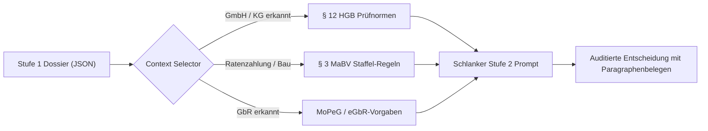
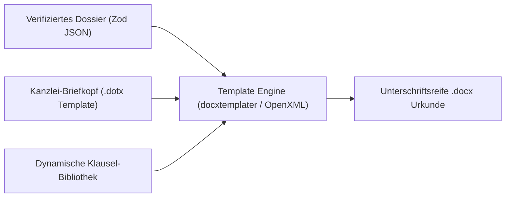
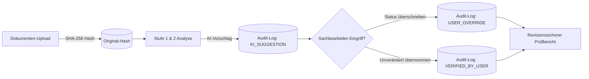
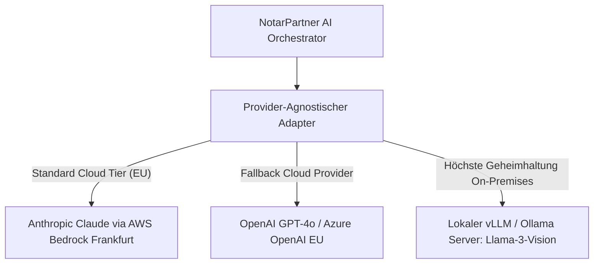
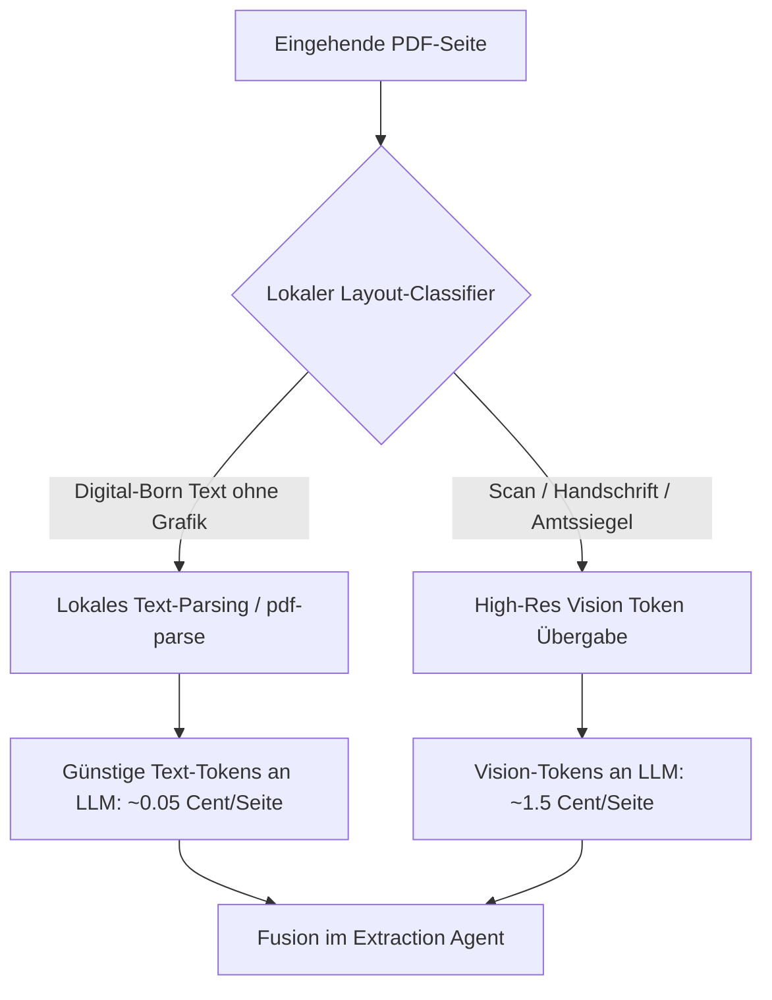
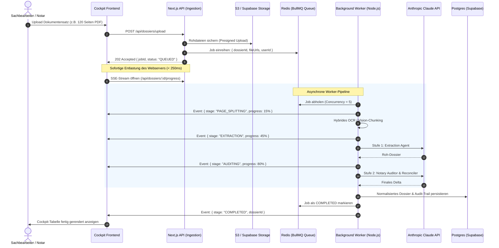
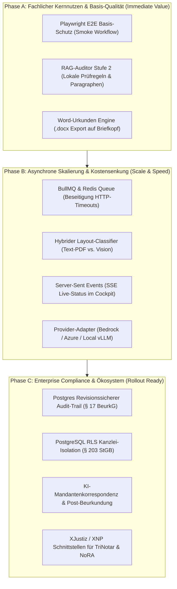

# Architektur-Roadmap für den skalierenden Live-Betrieb (Notariat 24/7)

> **Dokumentstatus:** Zentrale Architektur-Spezifikation für die Produktivüberführung (Single Source of Truth)  
> **Bezugssystem:** NotarPartner Urkunden-Zuarbeit (Next.js 16, TypeScript, Claude Vision, Supabase)

---

## 1. Executive Summary: Vom Prototyp zum Enterprise-Kanzleisystem

Der vorliegende Prototyp beweist die fachliche Machbarkeit: Heterogene Urkundensätze werden über einen 2-stufigen Agenten-Workflow (Extraction + Notary Auditor) rechtssicher, auditierbar und mit Human-in-the-Loop aufbereitet.

Für den **Produktivbetrieb in Notariaten** mit täglichen Lastspitzen, Großaktenbänden (50–200 Seiten), strengsten Berufsgeheimnis-Vorgaben (§ 203 StGB / § 18 BNotO) und dem Anspruch auf echte Arbeitserleichterung im Kanzleialltag definiert dieses Dokument die Kernsäulen der Ziel-Architektur sowie einen nach **technischem ROI und Abhängigkeiten priorisierten Phasenplan**:

1. **Fachliche Kern-Module:** RAG-gestützter Auditor, unterschriftsreife Word-Generierung (`.docx`), automatisierte Mandantenkorrespondenz und Post-Beurkundungsvollzug.
2. **Qualitäts-Fundament & Kanzlei-Compliance:** Playwright E2E-Automation, revisionssicherer Audit-Trail & Zero-Data-Retention (ZDR).
3. **Provider-Flexibilität & Kostensenkung:** Multi-LLM Adapter (Bedrock, Azure, Local vLLM) und hybrides OCR/Vision-Pre-Filtering (60–75 % Ersparnis).
4. **Asynchrone Hintergrundverarbeitung:** BullMQ & Redis-Worker zur Beseitigung von HTTP-Timeouts bei Großakten mit Live-Status (SSE).
5. **Mandantenfähigkeit & Kanzlei-Isolation:** PostgreSQL Row-Level Security (RLS) zur hermetischen Trennung fremder Kanzleidaten (§ 203 StGB).
6. **Ökosystem & Fachverfahren:** Standardisierter XJustiz- / XNP-Export zur medienbruchfreien Integration in TriNotar, NoRA, Notar 4.0 und RA-MICRO sowie Rechtsgebiets-Expansion.

---

## 2. Fachliche Kern-Module (The Notary Core)

### 2.1 RAG-gestützter Notary Auditor (Stufe-2-Optimierung)

- **Zielkomponente:** `Notary Auditor & Reconciler` in `src/app/api/analyze/route.ts`
- **Kernnutzen:** **70–90 % Token-Ersparnis**, maximale **Deterministik** und rechtssichere Begründungen mit Paragraphenbelegen.

#### Problem im Status Quo

Aktuell prüft Stufe 2 mit statischen Faustregeln im Prompt (z. B. 10 Jahre GEG, § 21 BeurkG).

- **Prompt-Bloat:** Sondergesetze (MoPeG für GbRs, MaBV-Raten, Sanierungsvermerke nach § 144 BauGB) können nicht alle statisch im Prompt stehen, ohne Token-Kosten und Kontextgrenzen zu sprengen.
- **Ungenaue Nachforderungen:** Fehlen Belege, moniert das System oft generisch (_„Vollmacht fehlt“_ statt _„Registerauszug gem. § 12 HGB nötig“_).

#### Lösung: Deterministisches Just-in-Time Retrieval

Statt eines unübersehbaren „Mega-Prompts“ holt sich Stufe 2 **nur die Regeln, die zum konkreten Fall passen**:



#### Wissensbasis (3 Säulen)

1. **Gesetzliche Prüfnormen:** BGB, BeurkG, GBO, GEG (10-Jahres-Frist), MaBV, HGB.
2. **Kanzlei-Standards:** Interne Checklisten nach Vorgangstyp (Gewerbekauf, Überlassung, WEG).
3. **Zwischenverfügungs-Prävention:** Historische Beanstandungen lokaler Grundbuchämter (z. B. Klauselerfordernisse spezifischer Amtsgerichte).

#### Phasenweise Umsetzung

- **Phase 1 (Quick Win):** [x] **Fertiggestellt & Verifiziert** — Lokale strukturierte Checklisten in `src/lib/knowledge/rules/` (`rules-registry.ts`, `rule-selector.ts`), deterministisch in Stufe 2 Prompt injiziert (`pipeline.ts`) mit 100 % Unit-Test-Abdeckung (`rule-selector.test.ts`).
- **Phase 2 (Erweitert):** [ ] Hybrid Search (BM25 für Paragraphen + `pgvector` in Supabase) für Kanzleisammlungen und DNotI-Gutachten.
- **Phase 3 (Enterprise):** [ ] Mandantenisolierte Kanzlei-Wissensbasis mit PostgreSQL Row-Level Security (§ 18 BNotO / § 203 StGB).

---

### 2.2 Word-Urkunden-Engine (Template & OpenXML Pipeline)

- **Ziel:** 100 % unterschriftsreife Word-Dokumente (`.docx`) auf Kanzlei-Briefkopf ohne Copy-Paste-Fehler.
- **Ausgangslage:** Notare verlesen im Beurkundungstermin ausschließlich Microsoft Word. Statische PDF-Exporte sind für Kanzleien im Termin unbrauchbar.



- **Bedingte Klausel-Injektion (Conditional Logic):**
  - Z. B. Barzahlung vs. Finanzierung: Automatischer Einschub der Belastungsvollmacht und Zwangsvollstreckungsunterwerfung (§ 800 ZPO).
- **Typografische Kanzlei-Standards:**
  - Saubere Verlese-Absätze, geschützte Leerzeichen bei Geldbeträgen (`150.000,00 €`), Einrückungen und Paragraphen-Nummerierung.
- **Multi-Dokumenten-Set:**
  - Erzeugung des gesamten Pakets auf Knopfdruck: Haupturkunde, Vollmachten, Belehrungsanhang.

---

### 2.3 KI-Mandantenkorrespondenz & Entwurfsversand

- **Ziel:** Automatisierte, individuelle Begleitschreiben und Entwurfs-E-Mails an Mandanten, Makler und Banken (Schritt 03 auf beta.notarpartner.de).
- **Rechtssichere Hinweise:** Schreiben werden dynamisch aus dem Dossier generiert (z. B. konkreter Hinweis an den Käufer auf die gesetzliche 14-tägige BGB-Verbraucherprüffrist gem. § 17 Abs. 2a BeurkG).
- **Automatisierter Adressaten-Filter:**
  - _An Käufer/Verkäufer:_ Verständliche Erläuterung der nächsten Schritte (Fälligkeitsvoraussetzungen, Übergabe).
  - _An finanzierende Bank:_ Gezielte Übersendung des Grundschuldentwurfs mit Treuhandauflagen-Bestätigung.
- **Audit-Konnexität:** Revisionssichere Archivierung aller versendeten Entwürfe und Begleitschreiben.

---

### 2.4 Beschleunigte Abwicklung & Vollzug (Post-Beurkundung)

- **Ziel:** Automatisierung der Nachbereitungs- und Vollzugsphase nach der Beurkundung (Schritt 04 auf beta.notarpartner.de).
- **Automatisierte Behörden- & Vollzugssätze auf Knopfdruck:**
  - **Grundbuchamt:** Anträge auf Eigentumsvormerkung, Eigentumsumschreibung und Grundschuldeintragung.
  - **Gemeinde / Finanzamt:** Anforderung der Vorkaufsrechtsverzichtserklärung (§ 28 BauGB) und Unbedenklichkeitsbescheinigung.
  - **Fälligkeitsmitteilung:** Präzise Berechnung von Zahlungsziel, Bank-IBANs und Treuhandabzügen nach Eintritt aller Voraussetzungen.

---

## 3. Qualitäts-Fundament & Kanzlei-Compliance (Test-First)

### 3.1 Vollständige E2E-Testsuite mit Playwright

Bevor infrastrukturelle Umbauten anstehen, sichert eine Ende-zu-Ende-Testsuite das Kernverhalten des Sachbearbeiter-Workflows ab:

1. **Upload großer Aktenpakete:**
   - Multi-File-Drag-and-Drop (6–10 PDFs gleichzeitig) unter realistischen Netzwerkbedingungen.
2. **Kollaboratives Human-in-the-Loop:**
   - Simuliertes Überschreiben eines Feldwertes durch den Sachbearbeiter (z. B. manueller Status-Wechsel von `NEEDS_REVIEW` auf `VERIFIED`).
   - Verifikation, dass manuelle Korrekturen den Audit-Trail nicht beschädigen.
3. **Barrierefreiheit & Keyboard-Navigation:**
   - Volle Bedienbarkeit der Cockpit-Tabelle via Tastatur (WCAG 2.1 AA Konformität für Kanzleiarbeitsplätze).
4. **UI/UX-Polishing & Responsiveness:**
   - Überführung der prototypischen Oberfläche in ein voll ausgereiftes Kanzlei-Designsystem (Abstände, Ladezustände, Feedback-Banner, Begleitansicht).

### 3.2 Revisionssicherer Kanzlei-Audit-Trail & Beweissicherung (§ 17 ff. BeurkG)

Da der Notar persönlich für den Urkundeninhalt haftet, protokolliert eine Append-Only-Tabelle in PostgreSQL gerichtsfest jeden Bearbeitungsschritt:



- **Inhalt jedes Audit-Eintrags:**
  - Zeitstempel (UTC ISO-8601), User-ID und Kanzlei-ID.
  - Betroffenes Feld (`fieldKey`) sowie Vorher-/Nachher-Zustand.
  - Zwingende Pflichtbegründung bei manuellem Überschreiben von Warnungen (`NEEDS_REVIEW` -> `VERIFIED`).
  - SHA-256-Fingerprint der zugrundeliegenden Quelldatei.

### 3.3 Zero-Data-Retention (ZDR) Vertragskonfiguration

- Sicherstellung, dass über Enterprise-Vereinbarungen (Anthropic BAA oder AWS Bedrock / Google Cloud Frankfurt) das 30-tägige Abuse-Monitoring-Logging der KI-Provider vollständig deaktiviert ist (0 Tage Speicherung).

---

## 4. Provider-Flexibilität & Kostensenkung (High ROI)

### 4.1 Provider-Agnostisches Multi-LLM & On-Premises (Local Models)

Zur Vermeidung von Vendor-Lock-in und zur Einhaltung höchster Geheimhaltungsstufen:



- **Lokales Hosting:** Für Bundeswehr-Liegenschaften oder Verschlusssachen können Open-Source-Vision-Modelle (z. B. Mistral Pixtral, Llama 3.2 Vision) auf kanzleieigener GPU-Hardware betrieben werden.

### 4.2 Hybride OCR- & Vision-Pipeline (60–75 % Kostenersparnis)

Im Notariat sind mindestens 70 % der Seiten reine maschinelle Textdokumente (Fließtext alter Kaufverträge, E-Mails, Anschreiben).



- **Effekt:** Drastische Senkung der laufenden Betriebskosten bei 100 % Erhalt der Erkennungsqualität für Siegel, Stempel und Handschriften.

---

## 5. Asynchrone Hintergrundverarbeitung (BullMQ & Redis)

### 5.1 Problemstellung im Kanzleialltag

| Problem                      | Auswirkung ohne Queue (Synchron)                                                                                             | Lösung mit BullMQ & Redis                                                                                       |
| :--------------------------- | :--------------------------------------------------------------------------------------------------------------------------- | :-------------------------------------------------------------------------------------------------------------- |
| **HTTP-Timeouts**            | Proxies (Cloudflare/Nginx/Vercel) kappen Verbindungen nach 30–60 s. Ein 100-Seiten-Lauf bricht mit `504 Gateway Timeout` ab. | Der HTTP-Upload antwortet in **< 250 ms** mit `202 Accepted`. Die Verarbeitung läuft entkoppelt im Hintergrund. |
| **Tab-Schließung / Abbruch** | Sachbearbeiter schließt das Browser-Fenster -> Lauf bricht ab, teure LLM-Tokens sind verbrannt.                              | Jobs persistieren in Redis; der Sachbearbeiter kann den Rechner wechseln oder herunterfahren.                   |
| **Peak-Load & Rate Limits**  | Wenn morgens um 09:00 Uhr 8 Mitarbeiter gleichzeitig Akten hochladen, drohen `429 Rate Limits` oder RAM-Crash.               | **Concurrency Control:** Queue arbeitet z. B. exakt 5 Dokumente parallel ab; Überhang wartet geordnet.          |
| **Transiente API-Fehler**    | KI-Server überlastet (`529 Overloaded`) -> Vorgang scheitert.                                                                | Automatischer **Exponential Backoff Retry** (z. B. nach 5s, 15s, 45s) ohne Nutzerintervention.                  |

### 5.2 Ziel-Architektur (Sequence Diagram)



---

## 6. Mandantenfähigkeit (Multi-Tenancy) & Kanzlei-Isolation (§ 203 StGB)

### 6.1 Das berufsrechtliche Gebot der strikten Trennung

Notariate unterliegen der berufsrechtlichen Verschwiegenheitspflicht (§ 18 BNotO) und dem strafbewehrten Berufsgeheimnis (§ 203 StGB). In einem mandantenfähigen Cloud-Setup darf unter keinen Umständen ein Datenabfluss zwischen verschiedenen Kanzleien (Tenants) oder innerhalb einer Sozietät bei Mandatskonflikten möglich sein.

### 6.2 Technisches Design: Row-Level Security (RLS) in PostgreSQL

Statt die Mandantentrennung fehleranfällig im Applikationscode zu verwalten, setzt die Ziel-Architektur auf **PostgreSQL Row-Level Security (RLS)** auf Datenbank-Kernel-Ebene:

```sql
ALTER TABLE dossiers ENABLE ROW LEVEL SECURITY;
ALTER TABLE documents ENABLE ROW LEVEL SECURITY;
ALTER TABLE audit_logs ENABLE ROW LEVEL SECURITY;

CREATE POLICY tenant_isolation_policy ON dossiers
  FOR ALL
  USING (organization_id = current_setting('app.current_organization_id', true)::uuid);
```

### 6.3 Rollen- und Rechtematrix (Kanzlei-RBAC)

| Rolle                                        | Berechtigungen im System                                                                                                                                    |
| :------------------------------------------- | :---------------------------------------------------------------------------------------------------------------------------------------------------------- |
| **Notar / Notarassessor**                    | Vollzugriff: Letztentscheidung über Freigaben, finale Status-Overrides, Export in Fachverfahren, Einsicht in unveränderliche Audit-Logs.                    |
| **Notarfachangestellte(r) / Sachbearbeiter** | Operativer Zugriff: Akten-Upload, Klärung von `NEEDS_REVIEW`, Einpflegen von Notizen und Nachträgen, Vorbereitung des Prüfberichts.                         |
| **Rechtsanwalt / Partner (Anwaltsnotariat)** | Selektiver Zugriff: Nur Einsicht in Akten, bei denen kein Mandatskonflikt vorliegt.                                                                         |
| **Kanzlei-Administrator**                    | Technischer Zugriff: Nutzerverwaltung, API-Schlüssel-Konfiguration (ZDR), Schnittstellenanbindung – **kein** Einblick in Mandantenakten ohne Audit-Eintrag. |

---

## 7. Ökosystem, Fachverfahren & Rechtsgebiets-Expansion

### 7.1 Fachverfahren- & Notarnetz-Integration

Der NotarPartner-Prototyp darf im Produktivbetrieb kein isoliertes Datensilo sein, sondern muss sich nahtlos in die bestehende Kanzlei-IT einfügen:

1. **XJustiz / XNP Standard-Export:**
   - Export der validierten Stammdaten (Beteiligte, Liegenschaften, Belastungen) im offiziellen **XJustiz-Standard (XML/JSON)**.
   - Direkter Import in marktführende Notariatsfachverfahren: **TriNotar**, **NoRA Advanced**, **Notar 4.0**, **RA-MICRO**.
2. **EGVP / Notarnetz-Konnexität:**
   - Vorbereitung für die sichere Übertragung über das Elektronische Gerichts- und Verwaltungspostfach (EGVP) und die Bundesnotarkammer-Infrastruktur.

### 7.2 Erweiterung auf weitere notarielle Rechtsgebiete

Über die discriminated Union `CaseType` und die dynamische Cockpit-Registry werden weitere Urkundentypen abgewickelt:

1. **Gesellschaftsrecht (`GMBH_GRUENDUNG`, Handelsregister):**
   - _Pflichtfelder:_ Gesellschafterliste, Stammkapital & Geschäftsanteile, Geschäftsführung & Vertretungsmacht, Satzung / Musterprotokoll, Gründungsvollmachten.
2. **Erbrecht & Nachlass (`ERBSCHEIN_TESTAMENT`):**
   - _Pflichtfelder:_ Erblasser & Sterbedatum, gesetzliche/gewillkürte Erbfolge, Erbenquoten, letztwillige Verfügungen, Pflichtteilsverzichtserklärungen.
3. **Familienrecht (`EHEVERTRAG_SCHIED`):**
   - _Pflichtfelder:_ Güterstand (Gütertrennung / Modifizierte Zugewinngemeinschaft), Unterhaltsvereinbarungen, Versorgungsausgleich.

---

## 8. Priorisierter Umsetzungs- und Phasenplan (Value & Dependency Driven)

Statt einer starren Nummerierung folgt die Umsetzung einem logischen **3-Stufen-Modell**: erst maximale Fachqualität & Sofort-Nutzen für Kanzleien, dann asynchrone Skalierung für Großakten, abschließend Enterprise-Kanzlei-Compliance vor dem breiten Rollout.



### Übersicht der Phasen & Umsetzungsstatus

| Phase       | Fokus                              | Hauptziel                                                    | Kern-Ergebnisse & Status                                                                                                                                                                                                                |
| :---------- | :--------------------------------- | :----------------------------------------------------------- | :-------------------------------------------------------------------------------------------------------------------------------------------------------------------------------------------------------------------------------------- |
| **Phase A** | **Fachlicher Kernnutzen**          | Sofortiger Mehrwert für Notare & Fehlerschutz                | • [x] **A.1 Basisschutz des UI-Flows via Playwright**<br>• [x] **A.2 RAG-Prüfregeln (JIT-Retrieval in Stufe 2)**<br>• [ ] A.3 `.docx`-Export für Beurkundungstermine                                                                    |
| **Phase B** | **Skalierung & Resilienz**         | Stabilität bei Aktenbänden (50–200 Seiten) & Kostenkontrolle | • [ ] B.1 Asynchrone BullMQ Queue & Worker-Prozess<br>• [ ] B.2 Hybrides OCR/Vision-Pre-Filtering (60–75 % Ersparnis)<br>• [x] **B.3 SSE-Streaming von Teilfortschritten ins Cockpit**<br>• [ ] B.4 Multi-LLM Provider-Adapter          |
| **Phase C** | **Enterprise & Kanzlei-Ökosystem** | Rechtliche Abnahme & Kanzlei-IT-Integration                  | • [ ] C.1 Append-Only Audit-Trail & Zero-Data-Retention<br>• [ ] C.2 PostgreSQL RLS Mandantentrennung (§ 203 StGB)<br>• [ ] C.3 KI-Mandantenkorrespondenz & Post-Beurkundung<br>• [ ] C.4 XJustiz-Export für TriNotar / NoRA / RA-MICRO |

### Detaillierter Fortschrittstracker (Phase A)

- [x] **Architektur-Fundament & Guardrails:**
  - [x] Separation of Policy and Mechanism (Materielle Rechtsregeln in `src/lib/knowledge/`, technischer Mechanismus in `src/lib/dossier/`)
  - [x] Dependency-Cruiser Invarianten (`domain-must-not-depend-on-ui`, `hooks-must-not-depend-on-ui`)
  - [x] ESLint AST Invariante gegen ungemergte Template-Strings in `className`
  - [x] Typsichere Dictionaries statt Magic Strings (`CASE_TYPES`, `FIELD_STATUS`, `CASE_STATUS`, `STATUS_LABELS_DE`)
- [x] **A.2 RAG-Auditor (JIT Rule Retrieval):**
  - [x] Typisierte Regel-Registry (`rules-registry.ts`) für GEG, BeurkG, HGB, GBO, BGB, BauGB
  - [x] Deterministischer JIT-Selektor (`rule-selector.ts`) nach Merkmalen aus Stufe 1
  - [x] Pipeline-Injektion in Stufe 2 Prompt (`pipeline.ts`)
  - [x] Unit-Test Suite mit 100 % Abdeckung (`rule-selector.test.ts`)
- [x] **A.1 Playwright E2E Basis-Schutz:**
  - [x] Smoke-Test Workflow (Dokument-Upload $\rightarrow$ Stepper $\rightarrow$ FieldCockpit-Tabelle $\rightarrow$ Status-Override $\rightarrow$ Export) in `e2e/smoke-workflow.spec.ts`
  - [x] Synthetische Urkunden-Fixtures in `e2e/fixtures/test-files.ts`
  - [x] Playwright-Konfiguration mit WebServer-Integration & Chromium Browser (`playwright.config.ts`, `npm run test:e2e`)
- [ ] **A.3 Word-Urkunden-Engine (`.docx`):**
  - [ ] Kaufvertrag-Template mit OpenXML / docxtemplater auf Kanzlei-Layout
  - [ ] Datenbindung aus dem verifizierten Dossier (Parteien, Grundbuch, Kaufpreis, Belastungen)
  - [ ] Download-Aktion im Cockpit
