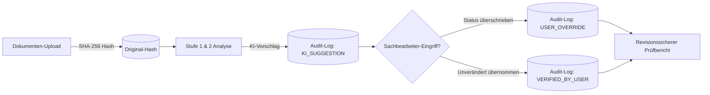
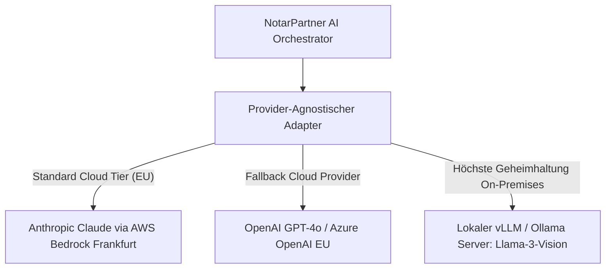
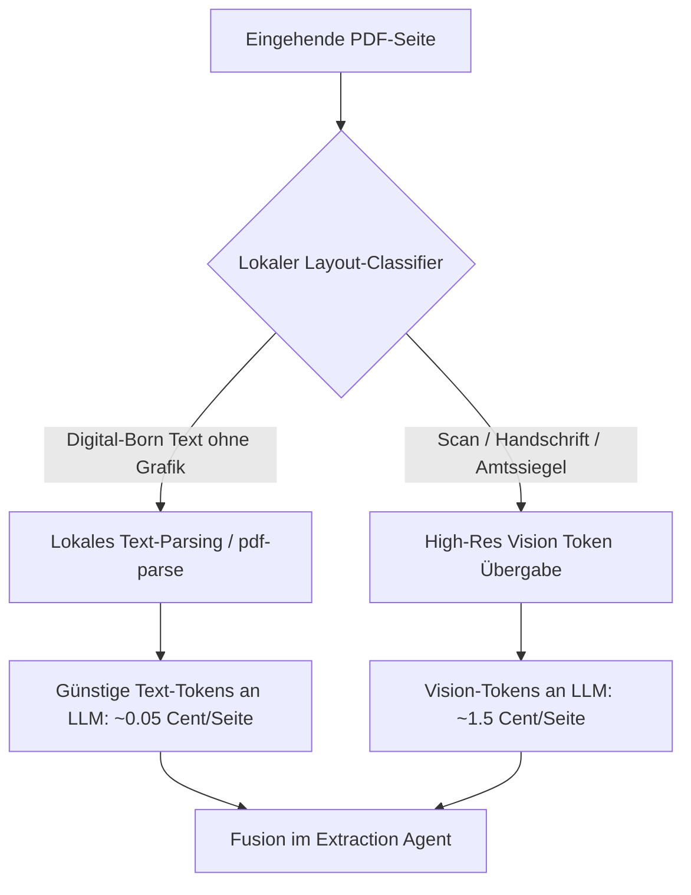
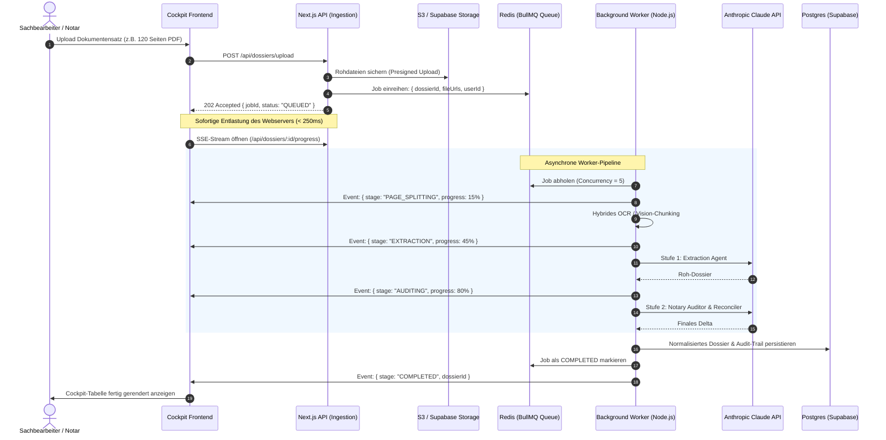

# Architektur-Roadmap für den skalierenden Live-Betrieb (Notariat 24/7)

> **Dokumentstatus:** Architektur-Spezifikation für die Produktivüberführung  
> **Bezugssystem:** NotarPartner Urkunden-Zuarbeit (Next.js 16, TypeScript, Claude Vision, Supabase)

---

## 1. Executive Summary: Vom Prototyp zum Enterprise-Kanzleisystem

Der vorliegende Prototyp beweist die fachliche Machbarkeit: Heterogene Urkundensätze werden über einen 2-stufigen Agenten-Workflow (Extraction + Notary Auditor) rechtssicher, auditierbar und mit Human-in-the-Loop aufbereitet.

Für den **Produktivbetrieb in Notariaten** mit täglichen Lastspitzen, Großaktenbänden (50–200 Seiten) und strengsten Berufsgeheimnis-Vorgaben (§ 203 StGB) definiert dieses Dokument die 5 Kernsäulen der Ziel-Architektur in ihrer logischen Umsetzungsreihenfolge:

1. **Qualitäts-Fundament & Kanzlei-Compliance:** Playwright E2E-Automation, revisionssicherer Kanzlei-Audit-Trail & Zero-Data-Retention (ZDR).
2. **Provider-Flexibilität & Kostensenkung:** Provider-agnostischer Multi-LLM Adapter (Bedrock, Azure, Local vLLM) und 60–75 % Kostenersparnis durch hybrides OCR/Vision-Pre-Filtering.
3. **Asynchrone Hintergrundverarbeitung:** BullMQ & Redis-Worker zur Beseitigung von HTTP-Timeouts bei Großakten mit Live-Status (SSE).
4. **Mandantenfähigkeit & Kanzlei-Isolation:** PostgreSQL Row-Level Security (RLS) zur hermetischen Trennung fremder Kanzleidaten (§ 203 StGB).
5. **Ökosystem & Fachverfahren:** Standardisierter XJustiz- / XNP-Export zur medienbruchfreien Integration in TriNotar, NoRA, Notar 4.0 und RA-MICRO sowie Expansion auf weitere Rechtsgebiete.

---

## 2. Qualitäts-Fundament & Kanzlei-Compliance (Test-First)

### 2.1 Vollständige E2E-Testsuite mit Playwright

Bevor infrastrukturelle Umbauten anstehen, sichert eine Ende-zu-Ende-Testsuite das bestehende Verhalten des Sachbearbeiter-Workflows ab:

1. **Upload großer Aktenpakete:**
   - Multi-File-Drag-and-Drop (6–10 PDFs gleichzeitig) unter realistischen Netzwerkbedingungen.
2. **Kollaboratives Human-in-the-Loop:**
   - Simuliertes Überschreiben eines Feldwertes durch den Sachbearbeiter (z. B. manueller Status-Wechsel von `NEEDS_REVIEW` auf `VERIFIED`).
   - Verifikation, dass manuelle Korrekturen den Audit-Trail nicht zerstören.
3. **Barrierefreiheit & Keyboard-Navigation:**
   - Volle Bedienbarkeit der Cockpit-Tabelle via Tastatur (WCAG 2.1 AA Konformität für Kanzleiarbeitsplätze).
4. **UI/UX-Polishing & Responsiveness:**
   - Überführung der prototypischen Oberfläche in ein voll ausgereiftes, responsives Kanzlei-Designsystem (Polishing von Abständen, konsistenten Ladezuständen, Fehler-Bannern und mobiler Begleitansicht).

### 2.2 Revisionssicherer Kanzlei-Audit-Trail & Beweissicherung (§ 17 ff. BeurkG)

Da der Notar persönlich für den Urkundeninhalt haftet, protokolliert eine Append-Only-Tabelle in PostgreSQL gerichtsfest jeden Bearbeitungsschritt:



- **Inhalt jedes Audit-Eintrags:**
  - Zeitstempel (UTC ISO-8601), User-ID und Kanzlei-ID.
  - Betroffenes Feld (`fieldKey`) sowie Vorher-/Nachher-Zustand.
  - Zwingende Pflichtbegründung bei manuellem Überschreiben von Warnungen (`NEEDS_REVIEW` -> `VERIFIED`).
  - SHA-256-Fingerprint der zugrundeliegenden Quelldatei.

### 2.3 Zero-Data-Retention (ZDR) Vertragskonfiguration

- Sicherstellung, dass über Enterprise-Vereinbarungen (Anthropic BAA oder AWS Bedrock / Google Cloud Frankfurt) das 30-tägige Abuse-Monitoring-Logging der KI-Provider vollständig deaktiviert ist (0 Tage Speicherung).

---

## 3. Provider-Flexibilität & Kostensenkung (Quick Wins – Hoher ROI)

### 3.1 Provider-Agnostisches Multi-LLM & On-Premises (Local Models)

Zur Vermeidung von Vendor-Lock-in und zur Einhaltung höchster Geheimhaltungsstufen:



- **Lokales Hosting:** Für Bundeswehr-Liegenschaften oder Verschlusssachen können Open-Source-Vision-Modelle (z. B. Mistral Pixtral, Llama 3.2 Vision) auf kanzleieigener GPU-Hardware betrieben werden.

### 3.2 Hybride OCR- & Vision-Pipeline (60–75 % Kostenersparnis)

Im Notariat sind mindestens 70 % der Seiten reine maschinelle Textdokumente (Fließtext alter Kaufverträge, E-Mails, Anschreiben).



- **Effekt:** Drastische Senkung der laufenden Betriebskosten bei 100 % Erhalt der Erkennungsqualität für Siegel, Stempel und Handschriften.

---

## 4. Asynchrone Hintergrundverarbeitung (BullMQ & Redis)

### 4.1 Problemstellung im Kanzleialltag

| Problem                                 | Auswirkung ohne Queue (Synchron)                                                                                               | Lösung mit BullMQ & Redis                                                                                       |
| :-------------------------------------- | :----------------------------------------------------------------------------------------------------------------------------- | :-------------------------------------------------------------------------------------------------------------- |
| **HTTP-Timeouts**                       | Proxies (Cloudflare/Nginx/AWS ALB) kappen Verbindungen nach 30–60 s. Ein 100-Seiten-Lauf bricht mit `504 Gateway Timeout` ab.  | Der HTTP-Upload antwortet in **< 250 ms** mit `202 Accepted`. Die Verarbeitung läuft entkoppelt im Hintergrund. |
| **Tab-Schließung / Verbindungsabbruch** | Sachbearbeiter schließt das Browser-Fenster -> Lauf bricht ab, teure LLM-Tokens sind verbrannt.                                | Jobs persistieren in Redis; der Sachbearbeiter kann den Rechner wechseln oder herunterfahren.                   |
| **Peak-Load & Rate Limits**             | Wenn morgens um 09:00 Uhr 8 Mitarbeiter gleichzeitig Akten hochladen, drohen Anthropic-`429 Rate Limits` oder RAM-Überlastung. | **Concurrency Control:** Queue arbeitet z. B. exakt 5 Dokumente parallel ab; Überhang wartet geordnet.          |
| **API-Spitzen / Transiente Fehler**     | KI-Server überlastet (`529 Overloaded`) -> Vorgang scheitert.                                                                  | Automatischer **Exponential Backoff Retry** (z. B. nach 5s, 15s, 45s) ohne Nutzerintervention.                  |

### 4.2 Ziel-Architektur (Sequence Diagram)



### 4.3 Beispielhafter Worker-Code (BullMQ)

```typescript
// workers/analysisWorker.ts
import { Worker, Job } from 'bullmq';
import { redisConnection } from '@/lib/redis';
import { executeTwoStageAnalysis } from '@/lib/ai/pipeline';
import { updateDossierInDatabase } from '@/lib/db';

export const analysisWorker = new Worker(
  'notary-dossier-analysis',
  async (job: Job) => {
    const { dossierId, documents } = job.data;

    await job.updateProgress({ stage: 'EXTRACTION', percent: 25 });

    const result = await executeTwoStageAnalysis(documents, {
      onProgress: async (p) => await job.updateProgress(p),
    });

    await updateDossierInDatabase(dossierId, result);
    return { success: true, dossierId };
  },
  {
    connection: redisConnection,
    concurrency: 5, // Maximal 5 parallele Aktenbearbeitungen
    limiter: {
      max: 50, // Max 50 Anfragen pro Minute
      duration: 60000,
    },
  }
);
```

---

## 5. Mandantenfähigkeit (Multi-Tenancy) & Kanzlei-Isolation (§ 203 StGB)

### 5.1 Das berufsrechtliche Gebot der strikten Trennung

Notariate unterliegen der berufsrechtlichen Verschwiegenheitspflicht (§ 18 BNotO) und dem strafbewehrten Berufsgeheimnis (§ 203 StGB). In einem mandantenfähigen Cloud-Setup darf unter keinen Umständen ein Datenabfluss zwischen verschiedenen Kanzleien (Tenants) oder innerhalb einer Sozietät bei Mandatskonflikten möglich sein.

### 5.2 Technisches Design: Row-Level Security (RLS) in PostgreSQL

Statt die Mandantentrennung fehleranfällig im Applikationscode zu verwalten, setzt die Ziel-Architektur auf **PostgreSQL Row-Level Security (RLS)** auf Datenbank-Kernel-Ebene:

```sql
ALTER TABLE dossiers ENABLE ROW LEVEL SECURITY;
ALTER TABLE documents ENABLE ROW LEVEL SECURITY;
ALTER TABLE audit_logs ENABLE ROW LEVEL SECURITY;

CREATE POLICY tenant_isolation_policy ON dossiers
  FOR ALL
  USING (organization_id = current_setting('app.current_organization_id', true)::uuid);
```

### 5.3 Rollen- und Rechtematrix (Kanzlei-RBAC)

| Rolle                                        | Berechtigungen im System                                                                                                                                    |
| :------------------------------------------- | :---------------------------------------------------------------------------------------------------------------------------------------------------------- |
| **Notar / Notarassessor**                    | Vollzugriff: Letztentscheidung über Freigaben, finale Status-Overrides, Export in Fachverfahren, Einsicht in unveränderliche Audit-Logs.                    |
| **Notarfachangestellte(r) / Sachbearbeiter** | Operativer Zugriff: Akten-Upload, Klärung von `NEEDS_REVIEW`, Einpflegen von Notizen und Nachträgen, Vorbereitung des Prüfberichts.                         |
| **Rechtsanwalt / Partner (Anwaltsnotariat)** | Selektiver Zugriff: Nur Einsicht in Akten, bei denen kein Mandatskonflikt vorliegt.                                                                         |
| **Kanzlei-Administrator**                    | Technischer Zugriff: Nutzerverwaltung, API-Schlüssel-Konfiguration (ZDR), Schnittstellenanbindung – **kein** Einblick in Mandantenakten ohne Audit-Eintrag. |

---

## 6. Ökosystem, Fachverfahren & Rechtsgebiets-Expansion

### 6.1 Fachverfahren- & Notarnetz-Integration

Der NotarPartner-Prototyp darf im Produktivbetrieb kein isoliertes Datensilo sein, sondern muss sich nahtlos in die bestehende Kanzlei-IT einfügen:

1. **XJustiz / XNP Standard-Export:**
   - Export der validierten Stammdaten (Beteiligte, Liegenschaften, Belastungen) im offiziellen **XJustiz-Standard (XML/JSON)**.
   - Direkter Import in marktführende Notariatsfachverfahren: **TriNotar**, **NoRA Advanced**, **Notar 4.0**, **RA-MICRO**.
2. **EGVP / Notarnetz-Konnexität:**
   - Vorbereitung für die sichere Übertragung über das Elektronische Gerichts- und Verwaltungspostfach (EGVP) und die Bundesnotarkammer-Infrastruktur.
3. **Office-Integration (.docx-Generierung):**
   - Automatische Befüllung der Kanzlei-spezifischen Kaufvertrags-Vorlagen mit den 10 verifizierten Datenfeldern unter Wahrung des kanzleieigenen Corporate Designs.

### 6.2 Erweiterung auf weitere notarielle Rechtsgebiete

Das Datenmodell ist über die discriminated Union `CaseType` und die dynamische Cockpit-Registry darauf ausgelegt, über dieselbe Verifikations- und Audit-Pipeline weitere Urkundentypen abzuwickeln:

1. **Gesellschaftsrecht (`GMBH_GRUENDUNG`, Handelsregister):**
   - _Pflichtfelder:_ Gesellschafterliste, Stammkapital & Geschäftsanteile, Geschäftsführung & Vertretungsmacht, Satzung / Musterprotokoll, Gründungsvollmachten.
2. **Erbrecht & Nachlass (`ERBSCHEIN_TESTAMENT`):**
   - _Pflichtfelder:_ Erblasser & Sterbedatum, gesetzliche/gewillkürte Erbfolge, Erbenquoten, letztwillige Verfügungen, Pflichtteilsverzichtserklärungen.
3. **Familienrecht (`EHEVERTRAG_SCHIED`):**
   - _Pflichtfelder:_ Güterstand (Gütertrennung / Modifizierte Zugewinngemeinschaft), Unterhaltsvereinbarungen, Versorgungsausgleich.

---

## 7. Implementierungs-Phasenplan (Nach ROI & logischen Meilensteinen)

```text
Meilenstein 1: Qualitäts-Fundament & Kanzlei-Compliance (Test-First)
  ├── Playwright E2E-Testsuite in CI/CD (Absicherung des bestehenden UI- & Review-Flows)
  ├── Revisionssicherer Kanzlei-Audit-Trail (Postgres Append-Only Table)
  ├── Zero-Data-Retention (ZDR) Vertragskonfiguration & Prüfung
  └── UI/UX-Polishing & Responsiveness (Kanzlei-Designsystem, Abstände, konsistente Feedback-Banner)

Meilenstein 2: Provider-Flexibilität & Kostensenkung (Quick Wins – Hoher ROI)
  ├── Provider-Agnostischer Multi-LLM Adapter (Anthropic, Bedrock, Azure OpenAI EU)
  ├── PDF-Vorfilter (Layout-Classifier: Digital-Born Text-Extraktion vs. Vision-Tokens -> 60-75% Ersparnis)
  └── Lokaler LLM-Fallback-Modus (vLLM / Ollama für sensible Offline-Akten)

Meilenstein 3: Asynchrone Entkopplung & Resilienz (Großakten)
  ├── Redis-Cluster anbinden (Managed Redis)
  ├── BullMQ Ingestion Queue & Worker-Prozess implementieren
  ├── Intelligentes Seiten-Chunking für Aktenbände > 50 Seiten
  └── Server-Sent Events (SSE) für Live-Statusanzeige im Cockpit

Meilenstein 4: Multi-Tenancy & Rollenrechte (Enterprise Security)
  ├── PostgreSQL Row-Level Security (RLS) für strikte Kanzlei-Isolation (§ 203 StGB)
  ├── Kanzlei-RBAC (Notar, Sachbearbeiter, Administrator)
  └── Mandanten-Dashboard für Kanzleiverwaltung

Meilenstein 5: Fachverfahren-Ökosystem & Rechtsgebiets-Expansion
  ├── XJustiz / XNP Schnittstellen-Export für TriNotar, NoRA & RA-MICRO
  └── CaseType-Erweiterung für Gesellschaftsrecht (GmbH-Gründung) & Erbscheine
```
