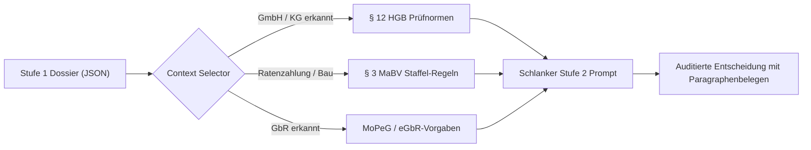
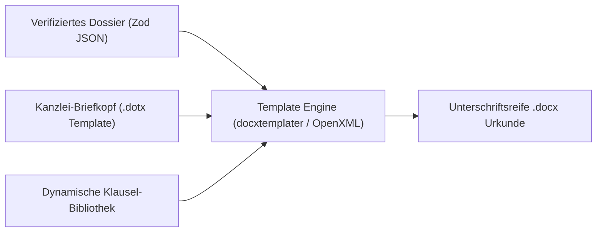

# Ergänzungen zur Architektur-Roadmap (Potentiale & Zukünftige Module)

> **Dokumentstatus:** Lebende Ergänzungsspezifikation zur `ARCHITECTURE_ROADMAP.md`  
> **Zweck:** Sammlung zukünftiger architektonischer und KI-spezifischer Erweiterungen, ohne die bestehende Haupt-Roadmap zu verändern.

---

## Modul 1: RAG-gestützter Notary Auditor (Stufe-2-Optimierung)

* **Zielkomponente:** `Notary Auditor & Reconciler` in `src/app/api/analyze/route.ts`
* **Kernnutzen:** **70–90 % Token-Ersparnis**, höhere **Deterministik** und rechtssichere Begründungen mit Paragraphenbelegen.

### 1. Problem im Status Quo
Aktuell prüft Stufe 2 mit statischen Faustregeln im Prompt (z. B. 10 Jahre GEG, § 21 BeurkG).
* **Prompt-Bloat:** Sondergesetze (MoPeG für GbRs, MaBV-Raten, Sanierungsvermerke nach § 144 BauGB) können nicht alle statisch im Prompt stehen, ohne Token-Kosten und Kontextgrenzen zu sprengen.
* **Ungenaue Nachforderungen:** Fehlen Belege, moniert das System oft generisch (*„Vollmacht fehlt“* statt *„Registerauszug gem. § 12 HGB nötig“*).

### 2. Die Lösung: Deterministisches Just-in-Time Retrieval
Statt eines unübersehbaren „Mega-Prompts“ holt sich Stufe 2 **nur die Regeln, die zum konkreten Fall passen**:

### 3. Wissensbasis (3 Säulen)
1. **Gesetzliche Prüfnormen:** BGB, BeurkG, GBO, GEG (10-Jahres-Frist), MaBV, HGB.
2. **Kanzlei-Standards:** Interne Checklisten nach Vorgangstyp (Gewerbekauf, Überlassung, WEG).
3. **Zwischenverfügungs-Prävention:** Historische Beanstandungen lokaler Grundbuchämter (z. B. spezielle Klauselerfordernisse des AG München).

### 4. Vorteile im Überblick
* **Kostensenkung (70–90 %):** Schlanker System-Prompt (~1.500 statt 30.000+ Tokens); ermöglicht den Einsatz kleinerer, schnellerer Prüfmodelle (z. B. Haiku / 4o-mini).
* **Keine Halluzinationen (Grounded):** Prüfung erfolgt gegen exakte Gesetzestexte und Kanzleiregeln, nicht nach „Modell-Bauchgefühl“.
* **Rechtssichere Nachforderungen:** Erzeugt zitierfähige Inquiries direkt mit Rechtsgrundlage (`legalBasis`) und konkreter Handlungsempfehlung (`suggestedAction`).

### 5. Umsetzung in Phasen
* **Phase 1 (Quick Win):** Lokale Markdown-/JSON-Checklisten in `src/lib/knowledge/rules/`, getriggert nach erkannten Merkmalen (ohne Vektor-DB).
* **Phase 2 (Erweitert):** Hybrid Search (BM25 für Paragraphen + `pgvector` in Supabase) für Kanzleisammlungen und DNotI-Gutachten.
* **Phase 3 (Enterprise):** Mandantenisolierte Kanzlei-Wissensbasis mit PostgreSQL Row-Level Security (§ 18 BNotO / § 203 StGB).

---

## Modul 2: Word-Urkunden-Engine (Template & OpenXML Pipeline)

* **Ziel:** 100 % unterschriftsreife Word-Dokumente (`.docx`) auf Kanzlei-Briefkopf ohne Copy-Paste-Fehler (Kernversprechen #1 von NotarPartner).
* **Ausgangslage:** Notare verlesen im Beurkundungstermin ausschließlich Microsoft Word. Statische PDF-Exporte sind für Kanzleien unbrauchbar.

### 1. Technische Architektur

### 2. Kernfunktionen
* **Bedingte Klausel-Injektion (Conditional Logic):**
  * Z. B. Barzahlung vs. Finanzierung: Automatischer Einschub der Belastungsvollmacht und Unterwerfungsklausel (§ 800 ZPO).
* **Typografische Kanzlei-Standards:**
  * Saubere Verlese-Absätze, automatische Paragraphen-Nummerierung, geschützte Leerzeichen bei Geldbeträgen (`150.000,00 €`) und Flurstücksnummern.
* **Multi-Dokumenten-Set:**
  * Ein Klick erzeugt das gesamte Paket: Haupturkunde, Vollmachten, Belehrungsanhang.

---

## Modul 3: KI-Mandantenkorrespondenz & Entwurfsversand

* **Ziel:** Automatisierte, individuelle Begleitschreiben und Entwurfs-E-Mails an Mandanten, Makler und Banken (Schritt 03 auf beta.notarpartner.de).

### 1. Kernnutzen
* **Keine generischen Standard-Floskeln:** Schreiben werden dynamisch aus dem Dossier generiert (z. B. konkreter Hinweis an den Käufer auf die 14-tägige BGB-Verbraucherprüffrist gem. § 17 Abs. 2a BeurkG).
* **Automatisierter Adressaten-Filter:**
  * *An Käufer/Verkäufer:* Verständliche Erläuterung der nächsten Schritte (Fälligkeit, Notaranderkonto, Übergabe).
  * *An finanzierende Bank:* Gezielte Übersendung des Grundschuldentwurfs mit Treuhandauflagen-Bestätigung.
* **Auditierbare Dokumentation:** Jedes versendete Schreiben wird revisionssicher im Kanzlei-Audit-Trail der Akte hinterlegt.

---

## Modul 4: Beschleunigte Abwicklung & Vollzug (Post-Beurkundung)

* **Ziel:** Vollständige Automatisierung der Nachbereitungs- und Vollzugsphase nach der Beurkundung (Schritt 04 auf beta.notarpartner.de).

### 1. Problem im Status Quo
Nach der Unterschrift beginnt die zeitaufwendige Abwicklung: Notarfachangestellte müssen Fristen überwachen, Behörden anschreiben und Banken informieren.

### 2. Automatisierte Dokumentensätze auf Knopfdruck
* **Grundbuchamt:** Anträge auf Eigentumsvormerkung, Eigentumsumschreibung und Grundschuldeintragung.
* **Gemeinde / Behörden:** Anforderung der Vorkaufsrechtsverzichtserklärung (§ 28 BauGB) und steuerlichen Unbedenklichkeitsbescheinigung (Finanzamt).
* **Käufer & Banken:**
  * Fälligkeitsmitteilung mit exakter IBAN- und Zahlungszielberechnung nach Eintritt aller Fälligkeitsvoraussetzungen.
  * Vollstreckbare Ausfertigungen gem. § 794 Abs. 1 Nr. 5 ZPO.

