# Architektur-Roadmap Additions & Backlog

> **Kontext:** Ergänzende Module, optionale Features und nachgelagerte Bausteine aus der primären Architektur-Roadmap ([ARCHITECTURE_ROADMAP.md](./ARCHITECTURE_ROADMAP.md)).

---

## 1. Word-Urkunden-Engine (Template & OpenXML Pipeline)

- **Priorisierung:** Nachgelagertes Backlog / optionaler Schritt (im Kernfokus steht primär die rechtssichere Prüfung, Validierung, Auditierung und Datenaufbereitung).
- **Ziel:** 100 % unterschriftsreife Word-Dokumente (`.docx`) auf Kanzlei-Briefkopf ohne Copy-Paste-Fehler.
- **Ausgangslage:** Notare verlesen im Beurkundungstermin üblicherweise Microsoft Word. Statische PDF-Exporte sind für Kanzleien im Termin unbrauchbar.

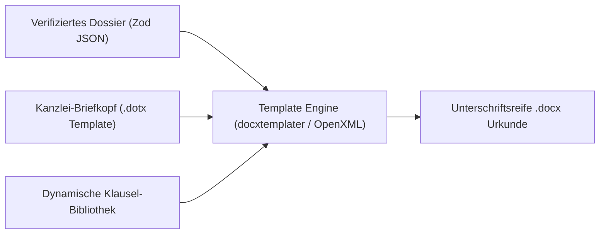

### Kernfunktionen

- **Bedingte Klausel-Injektion (Conditional Logic):**
  - Z. B. Barzahlung vs. Finanzierung: Automatischer Einschub der Belastungsvollmacht und Zwangsvollstreckungsunterwerfung (§ 800 ZPO).
- **Typografische Kanzlei-Standards:**
  - Saubere Verlese-Absätze, geschützte Leerzeichen bei Geldbeträgen (`150.000,00 €`), Einrückungen und Paragraphen-Nummerierung.
- **Multi-Dokumenten-Set:**
  - Erzeugung des gesamten Pakets auf Knopfdruck: Haupturkunde, Vollmachten, Belehrungsanhang.

### Geplante Aufgaben

- [ ] Kaufvertrag-Template mit OpenXML / docxtemplater auf Kanzlei-Layout
- [ ] Datenbindung aus dem verifizierten Dossier (Parteien, Grundbuch, Kaufpreis, Belastungen)
- [ ] Download-Aktion im Cockpit

---

## 2. Multi-LLM Provider-Adapter (AWS Bedrock / Azure / vLLM)

- **Priorisierung:** Nachgelagertes Backlog / optionaler Enterprise-Schritt (aktuell sind Google Gemini und Anthropic Claude via Vercel AI SDK produktionsbereit angebunden).
- **Ziel:** Vollständige Unabhängigkeit von einzelnen US-Cloud-Endpunkten, Unterstützung von EU-Only Cloud Tenants (AWS Bedrock Frankfurt, Azure EU Data Boundary) sowie On-Premises-Infrastruktur.
- **Ausgangslage:** In bestimmten Kanzleiumgebungen (z. B. Großkanzleien, Bundeswehr-/Sicherheitsliegenschaften oder bei Mandaten mit höchsten Geheimhaltungsvorschriften) ist der Einsatz von Public APIs untersagt.

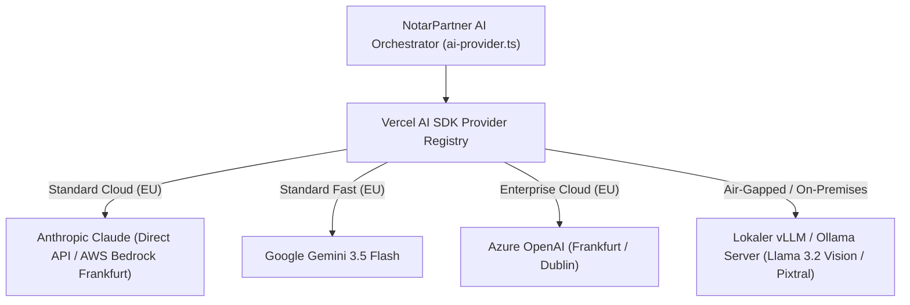

### Kernfunktionen

- **Dynamisches Provider-Routing:**
  - Konfigurierbare Endpunkte je Tenant über Umgebungsvariablen oder Kanzlei-Settings.
- **Zero-Code Switching:**
  - Standardisierte Schnittstelle über das Vercel AI SDK (`LanguageModel`), sodass Ingestion (`pipeline.ts`) und Reconciler völlig provider-agnostisch bleiben.
- **On-Premises Vision Fallback:**
  - Anbindung von lokal gehosteten OpenAI-kompatiblen Endpunkten (`baseURL` Konfiguration für vLLM/Ollama).

### Geplante Aufgaben

- [ ] AWS Bedrock Provider-Integration (`@ai-sdk/amazon-bedrock`)
- [ ] Azure OpenAI Provider-Integration (`@ai-sdk/azure`)
- [ ] Lokaler vLLM/Ollama Adapter via OpenAI-kompatibler Schnittstelle
- [ ] Tenant-spezifische Provider-Auswahl im Kanzlei-Profil

---

## 3. Zero-Data-Retention (ZDR) Vertragskonfiguration (Cloud Contractual)

- **Priorisierung:** Nachgelagertes Backlog / vertraglich-organisatorischer Schritt (ergänzend zu den technischen Hash- und Audit-Trail-Mechanismen aus Phase C.1).
- **Ziel:** Vollständiger Ausschluss der Speicherung sensibler Mandantendaten bei externen LLM-Providern zur Einhaltung von § 203 StGB und DSGVO.
- **Ausgangslage:** Standard-Cloud-APIs führen standardmäßig ein 30-tägiges Abuse-Monitoring-Logging durch, was für das notarielle Berufsgeheimnis ohne gesonderte Vereinbarung unzulässig ist.

### Kernanforderungen & Aufgaben

- [ ] Abschluss von Business Associate Agreements (BAA) / Zero-Data-Retention-Vereinbarungen mit Anthropic (0 Tage Logging)
- [ ] Konfiguration von Enterprise-ZDR für Google Cloud Vertex AI / AWS Bedrock (Region Frankfurt / EU-Only)
- [ ] Automatisierte Audit-Prüfung der API-Header auf ZDR-Compliance vor Übermittlung von Urkundeninhalten

---

## 4. Kanzlei-Observability, Crash-Reporting & Metriken (Zero-Overhead & Production-Ready)

- **Priorisierung:** Schlankes Fundament für den Produktivbetrieb (ergänzend zum bestehenden juristischen Audit-Trail gem. § 17 ff. BeurkG).
- **Ziel:** 100 % Industrie-Standard bei **minimaler betrieblicher Komplexität** („Boring Architecture“): Keine selbst gehosteten Monster-Cluster (wie ClickHouse/Redis/MinIO), sondern bewährte, wartungsfreie Managed-Lösungen mit strikter Einhaltung des Berufsgeheimnisses (§ 203 StGB).

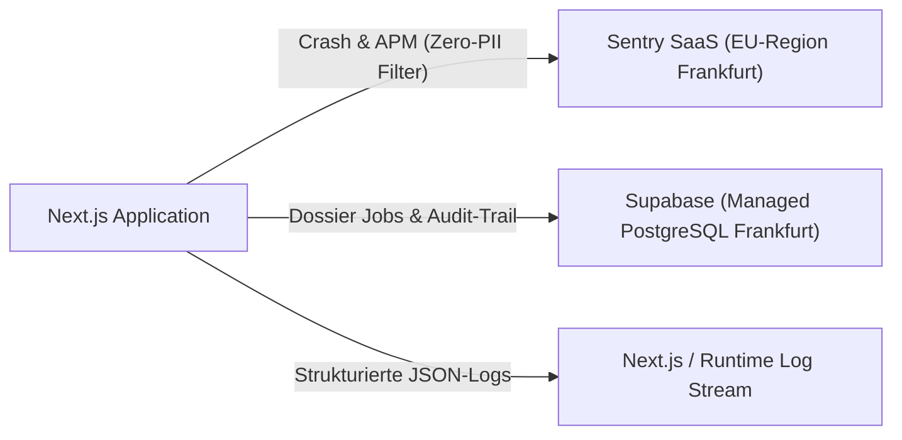

### Kernfunktionen

1. **Error-Tracking & APM via Managed Sentry (EU-Region Frankfurt):**
   - Offizielles `@sentry/nextjs` SDK für Backend-API-Routen und Client-Fehler.
   - **Strikte § 203 StGB / Zero-PII Konfiguration:** Client- und Server-Filter (`beforeSend`), die Dateiinhalte, Klarnamen und sensible Parameter restlos unkenntlich machen, bevor Exceptions übertragen werden.
   - Sofortige Alerts bei echten Runtime-Crashes oder API-Timeouts.
2. **LLM-Telemetrie via Vercel AI SDK Standard:**
   - Nutzung der integrierten OpenTelemetry-Hooks des Vercel AI SDK (`experimental_telemetry`).
   - Strukturierte JSON-Logs für jeden Pipeline-Lauf (Dauer, Token-Verbrauch, Modelltyp, Stage) direkt im Plattform-Logstream – ganz ohne zusätzlichen Serverbetrieb.
3. **Health-Check & Uptime-Monitoring:**
   - Schlanke Route `/api/health` zur Prüfung der Verfügbarkeit von Supabase (DB-Ping) und API-Konfiguration für externe Uptime-Checks (z. B. Better Uptime / Uptime Kuma).

### Geplante Aufgaben

- [ ] `@sentry/nextjs` Integration mit EU-Endpunkt
- [ ] PII-Scrubber in `sentry.server.config.ts` zur Absicherung des Berufsgeheimnisses
- [ ] Aktivierung der Vercel AI SDK Telemetrie in `pipeline.ts`
- [ ] Health-Check Endpunkt `/api/health` mit DB-Ping

---

## 5. Automatisierte CI/CD- & Release-Pipeline (GitHub Actions)

- **Priorisierung:** Nachgelagertes Backlog / DevOps-Fundament für Produktivüberführung.
- **Ziel:** Garantierte Ausfallsicherheit und Regression-Schutz bei jedem Release durch automatisierte Quality-Gates, Headless-E2E-Tests und Zero-Downtime-Deployments.
- **Ausgangslage:** Das Projekt verfügt bereits über strenge lokale Pre-Commit- und Check-Skripte (`npm run check`, `npm test`), jedoch existiert noch keine Remote-Pipeline in GitHub Actions, die Branches vor dem Merge unabhängig auf CI-Servern validiert und automatisch deployt.

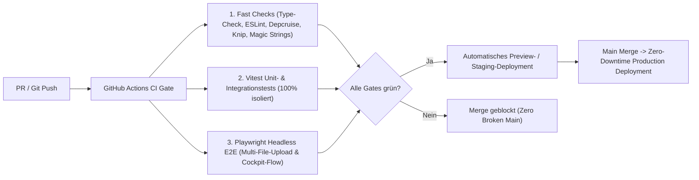

### Kernfunktionen

1. **Automatisierte PR-Gates (Continuous Integration):**
   - **Lint & Static Architecture:** Parallelisierte Ausführung von `npm run type-check`, `npm run lint`, `npm run depcruise`, `npm run knip`, `npm run audit:magic-strings` und `npm run audit:duplication`.
   - **Unit- & Integrations-Matrix:** Vollständiger Lauf aller Vitest-Suiten inklusive Mocking externer KI-APIs.
   - **Headless Playwright E2E:** Automatisches Hochfahren des Next.js-Testservers und Durchführen der Smoke- und Drag-and-Drop-Workflows im Headless-Chromium.
2. **Datenbank-Migrationen & Schema-Prüfung:**
   - Automatische Validierung neuer Supabase- / PostgreSQL-Migrationen (`audit_logs`, `dossier_jobs`) in einer isolierten Test-DB vor dem Release.
3. **Continuous Deployment (CD) & Multi-Container-Orchestrierung:**
   - Automatisches Preview-Deployment für jeden Pull Request zur visuellen Abnahme von Notariats-UI-Änderungen.
   - **Duale Prozess-Architektur (Web + Worker):** Zero-Downtime Rollout auf Produktivserver (Dokploy / Docker Compose / K8s).
     - `web`: Next.js Server (`npm run start`) für Nutzer-Interaktion und schnelle HTTP-Responses (`202 Accepted`).
     - `worker`: Autonomer Hintergrund-Daemon (`npm run worker`), der 24/7 PENDING Jobs abarbeitet und Zombie-Sweeper betreibt.
   - Automatische Generierung des optimierten Multi-Stage `Dockerfile` und `docker-compose.yml`.

### Geplante Aufgaben

- [ ] Multi-Stage `Dockerfile` (Node.js LTS, Runner-Separation) & `docker-compose.yml` (Web + Worker-Service)
- [ ] `.github/workflows/ci.yml` für automatische PR-Validierung (`check`, `test`, `build`)
- [ ] `.github/workflows/e2e.yml` für Playwright-Tests mit Browser-Caching
- [ ] Supabase CLI GitHub Action zur automatischen Prüfung von DB-Migrationen
- [ ] Konfiguration von Branch-Protection-Rules (Bedingung: Alle CI-Checks müssen bestehen vor Merge)
- [ ] CD-Deployment-Workflow für Dokploy / Docker (Staging & Production)

---

## 6. Production Hardening, API-Schutz & Kanzlei-Resilienz

- **Priorisierung:** Sicherheits- und Betriebshärtung für den ununterbrochenen Kanzleialltag.
- **Ziel:** Schutz vor DoS-/Kosten-Explosion, Eliminierung von Datenverlusten bei Netzwerkunterbrechungen und Einhaltung notarieller Aufbewahrungs- und Löschfristen (DONot).

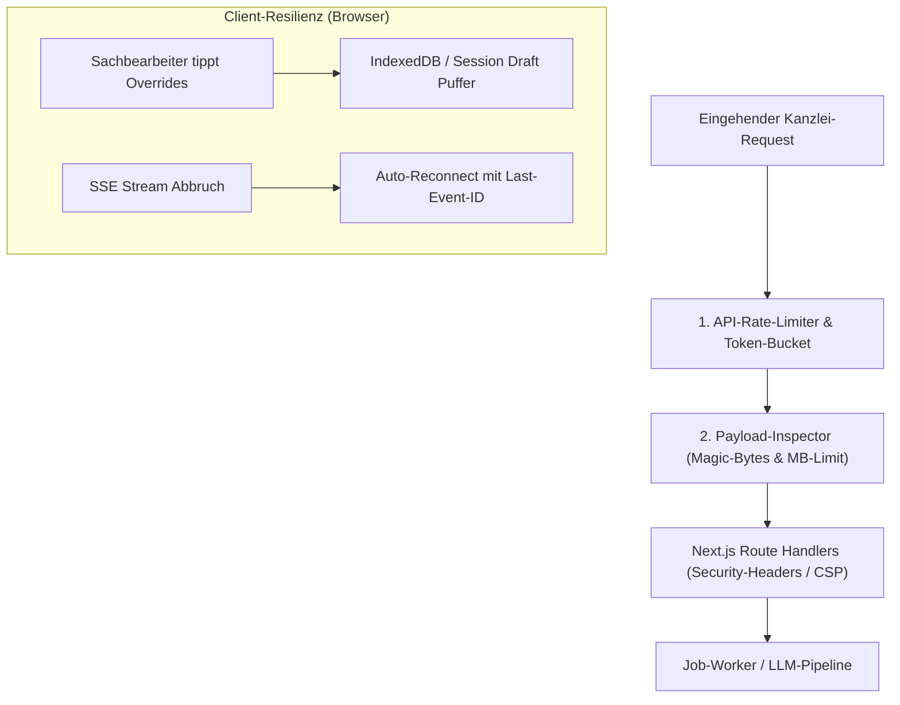

### Kernfunktionen

1. **API-Rate-Limiting & Kostenkontrolle:**
   - Token-Bucket / Sliding-Window-Algorithmus (z. B. via Upstash Redis oder LRU-Cache) für `/api/analyze` und `/api/jobs`.
   - Schutz vor Skript-Schleifen, versehentlichen Doppel-Submits und DoS-Angriffen, die teure multimodale LLM-Tokens verbrauchen.
2. **Payload-Schutz & MIME-Type Magic-Byte-Prüfung:**
   - Explizite Server-Constraints für Body-Größen vor dem Memory-Heap (Verhinderung von Node.js OOMs bei Base64-Payloads).
   - Validierung der binären Datei-Header (Magic Bytes) via `file-type`, um das Einschleusen manipulierter PDFs oder Skripte serverseitig zu blockieren.
3. **HTTP-Sicherheits-Header & Content Security Policy (CSP):**
   - Konfiguration strikter HTTP-Header in `next.config.ts`: `Content-Security-Policy`, `X-Frame-Options: DENY`, `Strict-Transport-Security (HSTS)` und `X-Content-Type-Options: nosniff`.
4. **Client-Draft-Persistence (Verbindungsabbruch-Schutz):**
   - Lokaler Draft-Puffer im Browser (`IndexedDB` oder `sessionStorage`) für `StatusOverrideReasonModal`.
   - Wenn während der Eingabe einer ausführlichen Begründung (§ 17 BeurkG) das WLAN abbricht, bleibt der Text erhalten und geht nicht verloren.
5. **Resilientes SSE-Streaming mit `Last-Event-ID`:**
   - EventSource-Reconnection mit Exponential Backoff.
   - Übermittlung des Headers `Last-Event-ID`, damit der Client bei temporärem Verbindungsabriss an der exakt letzten verarbeiteten Stage wieder aufsetzt, ohne den Job neu zu triggern.
6. **Notarielle Lösch- & Aufbewahrungsfristen (DONot / DSGVO):**
   - Automatisierte Datenbereinigung und Aktenvernichtung nach Ablauf der gesetzlichen Aufbewahrungsfristen (§ 5 Abs. 4 DONot: 5/10/30 Jahre).
   - Kryptografische Vernichtung archivierter Dokument-Payloads bei Erhalt des revisionssicheren Audit-Hashes.

### Geplante Aufgaben

- [ ] Rate-Limiting Middleware für `/api/analyze` und `/api/jobs`
- [ ] Magic-Byte-Validierung & Upload-Stream-Begrenzung im API-Layer
- [ ] Security-Header-Konfiguration (`headers()` in `next.config.ts`)
- [ ] Lokale Draft-Sicherung im `StatusOverrideReasonModal`
- [ ] `Last-Event-ID`-Unterstützung in `create-sse-stream.ts` und Client-Hooks
- [ ] Retention- und Lösch-Skript für Altdaten gem. DONot

---

## 7. Kanzlei-Briefkopf, Corporate Identity & Dokument-Branding

- **Priorisierung:** Kanzlei-Präsentation & Druckreife (Wesentliches NotarPartner-Feature).
- **Ziel:** Medienbruchfreier Export von Urkunden, Entwürfen, Anschreiben und Vollzugsdokumenten direkt auf dem offiziellen Kanzlei-Briefpapier des Notariats.

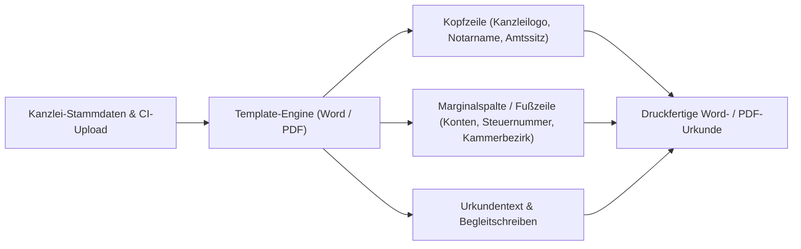

### Kernfunktionen

1. **Kanzlei-Profil & CI-Settings (`src/types/organization.ts`):**
   - Verwaltung der offiziellen Notarangaben (Amtssitz, Notar/-in, Notarassessor, Siegel-Informationen, Kammerzugehörigkeit).
   - Hinterlegung von Kanzleilogos (SVG / PNG hochauflösend) und Typografie-Standards.
2. **Dynamische Briefkopf-Integration:**
   - Platzierung von Kanzleibriefkopf, Fußzeile (IBAN für Anderkonten, USt-IdNr., Anschrift) in allen generierten `.docx`- und `.pdf`-Dokumenten.
   - Mandantenspezifische Umschaltung bei Sozietäten (Auswahl des beurkundenden Notars bei mehreren Amtsträgern).

### Geplante Aufgaben

- [ ] Kanzlei-Einstellungsdialog & Zod-Schema für Kanzlei-Stammdaten (`organization_settings`)
- [ ] Speicherung und Bereitstellung von Kanzlei-Logos und Siegel-Vektoren in Supabase Storage
- [ ] Injection-Adapter für Word-Templates (`docx`) und PDF-Renderer mit dynamischen Kanzleifeldern

---

## 8. Kanzlei-Muster- & Klauselbibliothek (Vorlagenverwaltung)

- **Priorisierung:** Praxis-Effizienz & Kanzlei-Standardisierung (Vergleichbar mit NotarPartner Regelungsbibliothek).
- **Ziel:** Kanzleien können ihre bewährten Standard-Vertragsmuster und individuellen Sonderklauseln hinterlegen und modular zusammenstellen, statt generische Standardtexte zu nutzen.

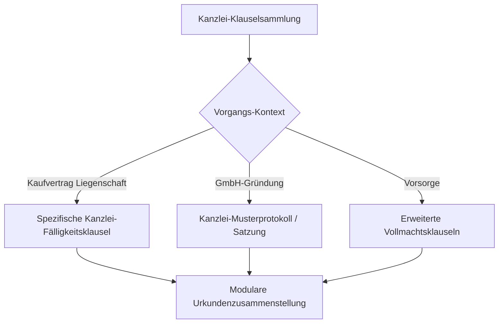

### Kernfunktionen

1. **Kanzlei-interne Klauseldatenbank (`clause_library`):**
   - Kategorisierte Speicherung nach Rechtsgebiet (Immobilien, Gesellschaftsrecht, Erbfolge, Familienrecht).
   - Variablen-System (z.B. `{{KAUFPREIS}}`, `{{VERKAEUFER_NAME}}`, `{{FLURSTUECK}}`), das automatisch aus dem Stufe-1/2-Dossier befüllt wird.
2. **Klausel-Alternativen & Fallback-Regeln:**
   - Bereitstellung von Klausel-Varianten (z.B. _„Kaufpreiszahlung mit Notaranderkonto“_ vs. _„Direktzahlung mit Fälligkeitsmitteilung“_).
   - Rechtliche Plausibilitätswarnungen bei inkompatiblen Klauselkombinationen.
3. **Muster-Import & Migration:**
   - Tool zum Importieren bestehender `.docx`-Muster aus Kanzleibeständen in modulare Datenbausteine.

### Geplante Aufgaben

- [ ] Schema `clauses` und `templates` mit RLS-Mandantenisolation
- [ ] UI für Kanzlei-Vorlagen-Editor und Klausel-Auswahl
- [ ] Template-Merging-Engine: Abgleich extrahierter Dossier-Felder mit Klausel-Variablen

---

## 9. Kanzlei-Vorgangsverwaltung & Dashboard (Dossier-Übersicht)

- **Priorisierung:** Kanzlei-Workflow & Team-Kollaboration.
- **Ziel:** Ganzheitliche Übersicht aller laufenden und abgeschlossenen Vorgänge einer Kanzlei, Zuweisung von Sachbearbeitern und Notaren sowie Fristenüberwachung.

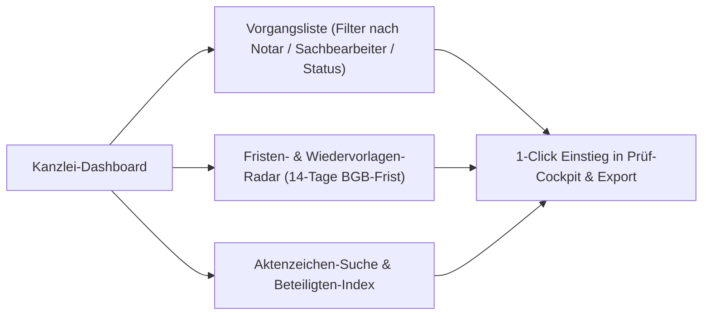

### Kernfunktionen

1. **Zentrales Kanzlei-Dashboard (`/dashboard` oder `/vorgänge`):**
   - Tabellarische Vorgangsübersicht mit Aktenzeichen, Beurkundungsdatum, Beteiligten, Sachbearbeiter und Bearbeitungsstatus (`ENTWURF`, `IN_PRÜFUNG`, `BEURKUNDUNGSREIF`, `VOLLZUG`, `ABGESCHLOSSEN`).
   - Schnelle Filterung: _„Meine Akten“_, _„Zur Notar-Freigabe“_, _„Fristen diese Woche“_.
2. **Beteiligten- und Liegenschafts-Index:**
   - Kanzleiweiter Schnellindex zur Vermeidung von Doppelerfassungen und Kollisionswarnung (z.B. Mandatskonflikte im Anwaltsnotariat gem. § 43a BRAO).
3. **Fristen- und Wiedervorlage-Management:**
   - Automatisches Tracking der gesetzlichen 14-tägigen Verbraucherprüffrist (§ 17 Abs. 2a BeurkG) und Vorkaufsrechtsfristen (§ 28 BauGB).

### Geplante Aufgaben

- [ ] Kanzlei-Dashboard-Page mit Volltextsuche und Filter-Facets
- [ ] Vorgangs-Zuweisung (`assigned_notary_id`, `assigned_clerk_id`) im Datenmodell
- [ ] Kollisions-Prüfmodul für Sozietäten und Anwaltsnotariate

---

## 10. Erweiterung auf weitere Rechtsgebiete (Multi-Domain Expansion)

- **Priorisierung:** Plattform-Skalierung (Gleichzug mit den 10 Urkundentypen von NotarPartner).
- **Ziel:** Strukturierte Datenerfassung, Extraktion und Prüfung für Gesellschafts-, Erb- und Familienrecht über Liegenschaften hinaus.

### Geplante Rechtsgebiete & Pflichtfeld-Schemata

1. **Gesellschaftsrecht (`GMBH_GRUENDUNG`, `GF_WECHSEL`, `HR_ANMELDUNG`):**
   - Gesellschafter, Stammeinlagen, Geschäftsführung, Vertretungsbefugnis, Stammkapital, Gegenstand, Satzungssonderklauseln.
2. **Erbrecht (`TESTAMENT`, `ERBVERTRAG`, `ERBSCHEINSANTRAG`):**
   - Erblasser, Verfügungen von Todes wegen, Erbenquoten, Vor-/Nacherbschaft, Vermächtnisse, Testamentsvollstreckung, Pflichtteilsverzicht.
3. **Vorsorge & Familie (`VORSORGEVOLLMACHT`, `EHEVERTRAG`):**
   - Vollmachtgeber, Bevollmächtigte, Innen-/Außenverhältnis, Patientenverfügung, Güterstand, Scheidungsfolgen.

### Geplante Aufgaben

- [ ] Definition typsicherer Zod-Schemas für die neuen Rechtsgebiete in `src/types/domains/`
- [ ] Prompt-Templates und JIT-Regeln für Gesellschaftsrecht und Erbrecht
- [ ] Cockpit-UI-Anpassung zur dynamischen Felddarstellung je nach `caseType`

---

## 11. Kanzlei-Authentifizierung, Rollen-UI & Session-Management (Auth & RBAC Frontend)

- **Priorisierung:** Kanzlei-Sicherheit & Berechtigungssteuerung (Ergänzung zu C.2).
- **Ziel:** Grafische Benutzeroberfläche zur Mitarbeiter- und Rollenverwaltung, Login-Flow mit Supabase Auth und rollenbasierte Aktionsfreigaben (RBAC) im Notariats-Cockpit.
- **Ausgangslage:** Das Backend und die Datenbank besitzen bereits RLS-Policies und Schemas (`NotaryRole`, `Organization`, `OrganizationMember`), es existiert jedoch noch keine Benutzeroberfläche für Authentifizierung, Rollen-Zuweisung und Berechtigungsprüfungen in der UI.

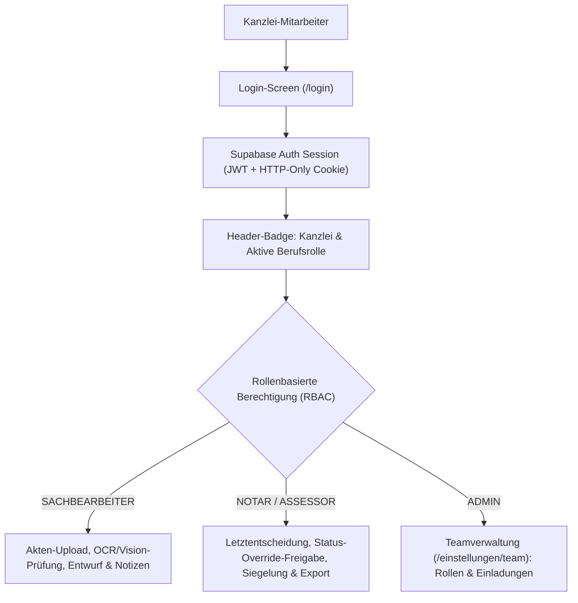

### Kernfunktionen

1. **Login & Authentifizierungs-Flow (`/login`):**
   - Kanzlei-Login via E-Mail & Magic-Link oder Passwort (Supabase Auth).
   - Session-Guard in Next.js Middleware: Automatische Weiterleitung unauthentifizierter Anfragen auf `/login`.
   - Automatisches Einspeisen der verifizierten `organization_id` und `user_id` aus dem Server-Session-Token in alle API- und Job-Aufrufe.
2. **Kanzlei-Header & Rollen-Badge (`Header.tsx`):**
   - Anzeige des Kanzleinamens und des Notaramtssitzes.
   - Visuelles Abzeichen der aktuellen Rolle (z.B. `[Dr. Kaufmann | Notar]` vs. `[Frau Weber | Notarfachangestellte]`).
3. **Team- & Rollenverwaltung (`/einstellungen/team` oder Modal):**
   - Übersicht aller Kanzlei-Mitarbeiter mit Name, E-Mail und Beitrittsdatum.
   - Dropdown zur Änderung der Berufsrolle (`NOTAR`, `NOTARASSESSOR`, `SACHBEARBEITER`, `ANWALTSNOTAR_RA`, `ADMIN`).
   - Dialog zum Einladen neuer Mitarbeiter per Kanzlei-E-Mail.
4. **Rollenabhängige UI-Sperren (RBAC Action Guards):**
   - `SACHBEARBEITER`: Kann Dossier-Felder bearbeiten, Warnungen begründen (`StatusOverrideReasonModal`) und Notizen anlegen.
   - `NOTAR` / `NOTARASSESSOR`: Exklusives Recht zur finalen Beurkundungsfreigabe und zum rechtsverbindlichen Urkunden-Export.
   - Buttons und sicherheitskritische Aktionen werden für nicht-berechtigte Rollen deterministisch mit Erklärungs-Tooltip deaktiviert.

### Geplante Aufgaben

- [x] Kanzlei- & Rollen-Badge im `Header.tsx` (`RoleBadge.tsx` mit interaktivem Notar-Profil- & Rollen-Switcher)
- [x] Team- & Rollenverwaltungs-View (`src/components/views/TeamSettingsView.tsx` mit Mitglieder-Tabelle, Rollenwechsel & Einladungsdialog)
- [x] RBAC-Engine & Hook (`src/lib/auth/rbac.ts`, `useAuth()`) zur rollenbasierten Aktionssteuerung im Cockpit (z.B. Deaktivierung der Aktenlöschung für Sachbearbeiter gem. § 18 BNotO)
- [x] Integration der `actorRole` in Status-Overrides & Audit-Trail-Events
- [ ] Login-Page (`src/app/login/page.tsx`) mit Supabase Auth Formular & Middleware-Session-Guard

---

## 12. Kanzlei-Wissensbasis & RAG-Inspektor UI (Begleit-UI für C.3)

- **Priorisierung:** Kanzlei-Transparenz & Wissensmanagement (Ergänzung zu C.3).
- **Ziel:** Eine grafische Maske zum Verwalten und Einsehen von Kanzlei-Standards, DNotI-Gutachten und Zwischenverfügungs-Präzedenzfällen der zuständigen Amtsgerichte.

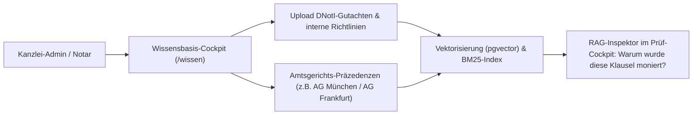

### Kernfunktionen

1. **Wissensbasis-Cockpit (`/wissen`):**
   - Dokumenten-Manager für Kanzlei-Muster, Sonderklauseln und Gutachten mit automatischer semantischer Vektorisierung.
   - Zuordnung zu Rechtsgebieten (Liegenschaften, Gesellschaftsrecht, Erbfolge).
2. **RAG-Inspektor im Prüf-Cockpit:**
   - Klick auf ein beanstandetes Feld öffnet eine Sidebar mit exaktem Fundstellen-Nachweis:
     - Relevante Norm (z.B. § 12 HGB, § 144 BauGB)
     - Amtsgerichts-Praxis (z.B. _„AG Hamburg verlangt zwingend den tagesaktuellen HR-Auszug bei GmbH-Vertretung“_)
     - Relevanter Textauszug aus internen Kanzlei-Leitfäden.

### Geplante Aufgaben

- [ ] Kanzlei-Wissensbasis-View (`/wissen`) für Dokumenten-Upload & Index-Übersicht
- [ ] RAG-Fundstellen-Inspector-Panel im `FieldCockpit`
- [ ] **Initial-Seed der Live-Datenbank:** Automatisierter Seeding-Lauf für `knowledge_documents` (Übertrag der kanonischen MoPeG-, HGB-, BauGB- und GBO-Gutachten aus `seed-knowledge.ts` in die PostgreSQL-Instanz).

---

## 13. Fail-Fast Repository-Architektur & Bereinigung stiller Fallbacks (Data Integrity & SSOT)

- **Priorisierung:** Datenintegrität & Revisionssicherheit (Single Source of Truth gem. AGENTS.md).
- **Ziel:** Beseitigung stiller Fallbacks bei Datenbankausfällen: PostgreSQL als Single Source of Truth mit transparentem Fehlerabbruch (`throw new Error`).
- **Ausgangslage:** In einigen Repositories (`SupabaseDossierRepository`, `SupabaseJobRepository`, `SupabaseKnowledgeRepository`) wurden DB-Fehler im `catch`-Block verschluckt und Daten still in flüchtigen RAM geschrieben. Beim Container-Neustart droht Datenverlust ohne Fehlermeldung.

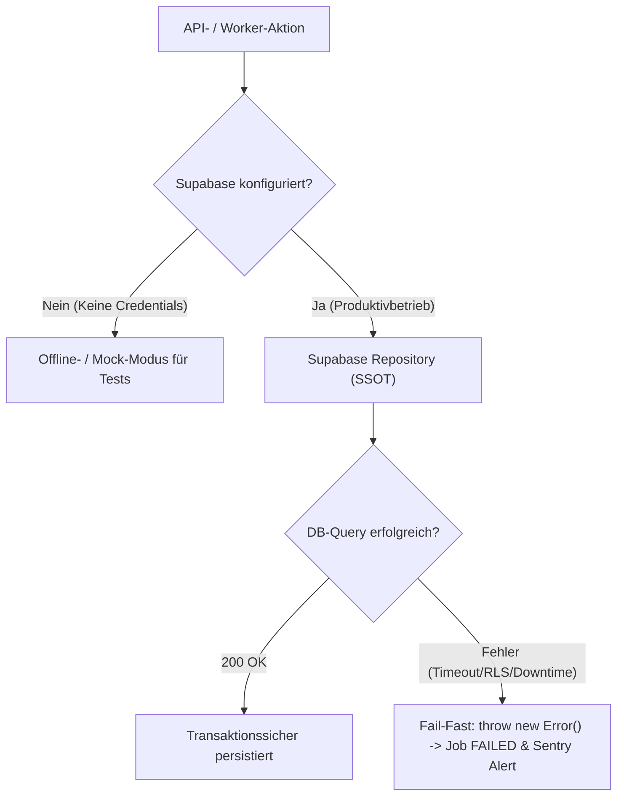

### Kernfunktionen & Aufgaben

1. **`SupabaseKnowledgeRepository`:**
   - Entfernung des `fallbackRepo`-Parameters im Produktiv-Konstruktor.
   - Harte Exceptions bei Supabase-Fehlern (`throw new Error(...)`).
   - Trennung in `getKnowledgeRepository()`: Demo-Modus vs. Supabase-Modus.
2. **`SupabaseJobRepository`:**
   - Entfernung der `fallbackRepo`-Aufrufe in `createJob`, `updateJobStatus`, `claimNextPendingJob` und `listJobs`.
   - Fehlerhafte DB-Operationen schlagen sofort fehl, damit der Job-Worker geregelte Retries durchführt statt phantomhaft im RAM weiterzulaufen.
3. **`SupabaseDossierRepository`:**
   - Entfernung der stillen `catch`-Fallbacks in `save`, `update`, `delete`, `findById` und `list`.
   - Garantiert, dass Notare eine explizite Fehlermeldung erhalten, wenn ein Dossier nicht in der PostgreSQL-Datenbank gespeichert werden konnte.

### Geplante Aufgaben

- [x] `SupabaseKnowledgeRepository` auf reines Fail-Fast umstellen & Tests aktualisieren
- [x] `SupabaseJobRepository` bereinigen (stille Fallbacks entfernen) & Tests aktualisieren
- [x] `SupabaseDossierRepository` bereinigen (stille Fallbacks entfernen) & Tests aktualisieren

---

## 14. Production Readiness & Go-Live Architecture (Custom Domain, SSL, Supabase Custom Auth & Enterprise SSO)

- **Priorisierung:** Kritischer Meilenstein für den echten Produktivbetrieb (Go-Live Readiness).
- **Ziel:** Bereitstellung einer gehärteten, hochverfügbaren und berufsrechtskonformen Betriebsumgebung für **Notar Agent** unter eigener Kanzlei-Domain ohne Prototyp-Artefakte.
- **Ausgangslage:** Die Applikation läuft aktuell mit lokalen Platzhaltern (`localhost:3000`) und temporären Supabase-Cloud-Endpunkten. Für den Live-Betrieb müssen DNS, TLS-Zertifikate, Session-Cookie-Partitionierung, OAuth-Consent-Screens und E-Mail-Zustellung aufeinander abgestimmt werden.

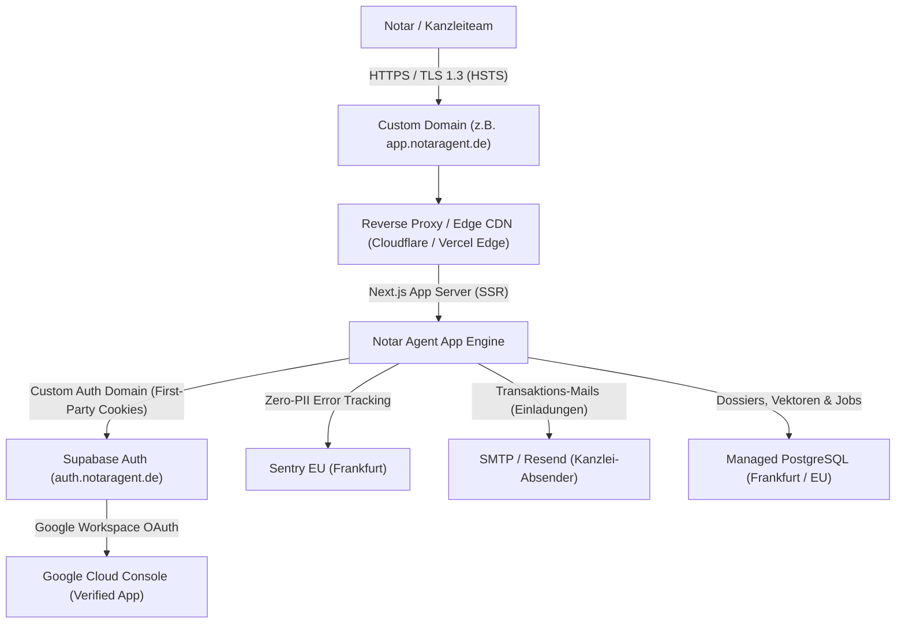

### Kernbausteine & Architektur-Anforderungen

#### 1. Domain- & DNS-Infrastruktur (Zero Trust & HSTS)

- **Kanzlei-Domain / Subdomain:** Bereitstellung einer dedizierten Produktions-Domain (z. B. `app.notaragent.de` oder `kanzlei-portal.de`).
- **Automatisches Zertifikatsmanagement:** TLS 1.3 only, erzwungenes HTTPS mit HSTS (`Strict-Transport-Security: max-age=63072000; includeSubDomains; preload`).
- **Sicherheits-Header in `next.config.ts`:**
  - `Content-Security-Policy (CSP)` gegen XSS
  - `X-Frame-Options: DENY` gegen Clickjacking
  - `X-Content-Type-Options: nosniff`
  - `Referrer-Policy: strict-origin-when-cross-origin`

#### 2. Supabase Custom Domain & First-Party-Cookies

- **Storage Partitioning & Cookie-Hygiene:** In modernen Browsern (Safari ITP, Chrome CHIPS) werden Cookies über Drittanbieter-Domains (`*.supabase.co`) blockiert oder nach 7 Tagen gelöscht.
- **Lösung:** Konfiguration einer **Custom Auth Domain** (z. B. `auth.notaragent.de` als CNAME auf den Supabase-Projekt-Ref).
- **Vorteil:** Die Auth-Cookies (`sb-access-token`, `sb-refresh-token`) agieren als echte **First-Party-Cookies**, was Session-Drops und Login-Schleifen im Notariatsalltag verhindert.
- **Produktions-Migration:** Live-Anwendung der Datei `supabase/migrations/20260917150000_auth_profiles_and_members.sql` und Aktivierung von RLS.

#### 3. Google & Enterprise SSO Go-Live Setup

- **Google Cloud Console Consent Screen:**
  - Konfiguration des OAuth-Zustimmungsbildschirms für Notar Agent (App-Name, Kanzlei-Support-E-Mail, Datenschutzerklärung).
  - Scope-Einschränkung auf `openid`, `email`, `profile` (keine unnötigen Berechtigungsabfragen).
  - Autorisierte Weiterleitungs-URIs: `https://<domain>/auth/callback` und `https://<supabase-project>.supabase.co/auth/v1/callback`.
- **Hinterlegung im Supabase Dashboard:**
  - Aktivierung des Google-Providers unter _Authentication > Providers > Google_.
  - Eintragen von Produktions-Client-ID und Client-Secret.
- **Enterprise SAML / Entra ID (Optional für Großnotariate):**
  - Vorbereitung für Microsoft 365 / Entra ID SSO über Supabase Enterprise SSO.

#### 4. Kanzlei-Transaktionsmails & E-Mail-Zustellung

- **Problem:** Supabase Default-E-Mails besitzen ein striktes Limit (3-4 Mails/Stunde) und landen wegen generischer Absender oft im Kanzlei-Spam.
- **Lösung:** Anbindung eines dedizierten SMTP-/Transaktionsmail-Dienstes (z. B. Resend, Postmark oder Microsoft 365 SMTP-Relay) mit DKIM, SPF und DMARC der Kanzlei-Domain.
- **Use Cases:** Einladung neuer Mitarbeiter ins Kanzleiteam (`/api/team`), Kennwort-Zurücksetzen, System-Benachrichtigungen.

#### 5. Produktions-Secrets & Zero-Data-Retention (ZDR)

- **Secrets Management:** Trennung lokaler Entwickler-Umgebungsvariablen (`.env.local`) von gesicherten Produktions-Umgebungsvariablen in der Hosting-Plattform.
- **ZDR-Invariante:** Sicherstellung, dass in der Produktionsumgebung `MOCK_AI=false` gesetzt ist und produktive API-Keys mit Zero-Data-Retention-Vereinbarung (Anthropic BAA / Google Cloud Vertex AI Frankfurt) greifen.
- **Health-Check & Monitoring:** Bereitstellung eines typsicheren `/api/health`-Endpunkts zur automatischen Uptime-Überwachung durch den Betreiber.

---

### Geplante Aufgaben (Go-Live Roadmap)

- [ ] **DNS & Domain:** Domain-Registrierung und Routing (CNAME / A-Record auf Production-Host)
- [ ] **Security Headers:** HSTS, CSP und Frameguard in `next.config.ts` konfigurieren
- [ ] **Custom Auth Domain:** Supabase CNAME-Routing (`auth.<domain>`) einrichten
- [ ] **DB-Migration:** `20260917150000_auth_profiles_and_members.sql` auf Live-PostgreSQL anwenden
- [ ] **Google OAuth:** Live-Credentials in Google Cloud Console & Supabase Auth aktivieren
- [ ] **SMTP / Mail-Relay:** Eigener Kanzlei-Mailversand für Einladungen via Resend / M365
- [ ] **Health-Check Route:** `/api/health` Endpunkt mit DB-Ping für Uptime-Monitoring bereitstellen
- [ ] **Zero-Data-Retention Check:** Validierung der Provider-Verträge vor erstem Echtakten-Scan

---

## 15. Kanzlei-Einladungs-Lifecycle & Token-Management (Benchmark: GitHub Org / Supabase Dashboard)

- **Priorisierung:** Qualitäts- und Sicherheits-Optimierung für die Kanzlei-Teamverwaltung (Ergänzung zu Modul 11).
- **Ziel:** Beseitigung sofortiger Dummy-Member-Einträge bei Einladungen. Strikte Trennung zwischen aktiven Mitgliedern und ausstehenden Einladungen nach modernem B2B-Standard.
- **Ausgangslage:** Beim Einladen eines neuen Mitarbeiters über `/api/team` wurde bisher sofort eine synthetische `user_id` direkt in `organization_members` erzeugt. In echten Systemen existiert dafür ein gesonderter Einladungs-Status mit kryptografischem Token, Ablaufzeit und Kanzlei-Akzeptierungsflow.

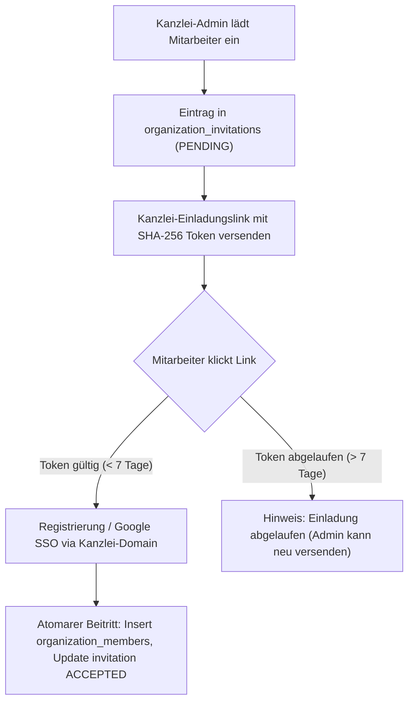

### Geplante Aufgaben

- [ ] **Datenbank-Tabelle `organization_invitations`:** Schema mit `organization_id`, `email`, `role`, `token_hash`, `expires_at` und `status` (`PENDING`, `ACCEPTED`, `REVOKED`, `EXPIRED`).
- [ ] **Einladungs-Management im Team-Cockpit:** Übersicht ausstehender Einladungen mit Aktionen „Erneut senden“ und „Widerrufen“.
- [ ] **Akzeptierungs-Flow (`/invitations/accept?token=...`):** Valider Beitritts-Workflow mit automatischer Zuordnung zur einladenden Kanzlei.

---

## 16. Enterprise Styling Grundattribute & Design Tokens (Benchmark: Linear, Clerk & Supabase)

- **Priorisierung:** Hohe UX- und Konsistenz-Priorität für das Kanzlei-Frontend (Design-System-Fundament).
- **Ziel:** Einheitliche, mathematisch harmonische Definition aller visuellen Grundattribute über das gesamte System hinweg, um inkonsistente Schriftgrößen, gestauchte Menüs oder willkürliche Abstände dauerhaft auszuschließen.
- **Industrie-Referenz:** Orientierung an den führenden Enterprise-B2B-Design-Systemen:
  - **Linear Design System:** Perfekt austarierte Typografie-Skala, konsistente Rhythmen (`leading`/`tracking`) und edle Schatten/Borders.
  - **Clerk UI Primitives:** Großzügige, lesbare Overlays, Dropdowns und Formular-Hierarchien.
  - **Supabase Dashboard:** Klare semantische Kontraste (`card`, `muted`, `accent`), ergonomische Dichte und barrierefreie Farbräume.

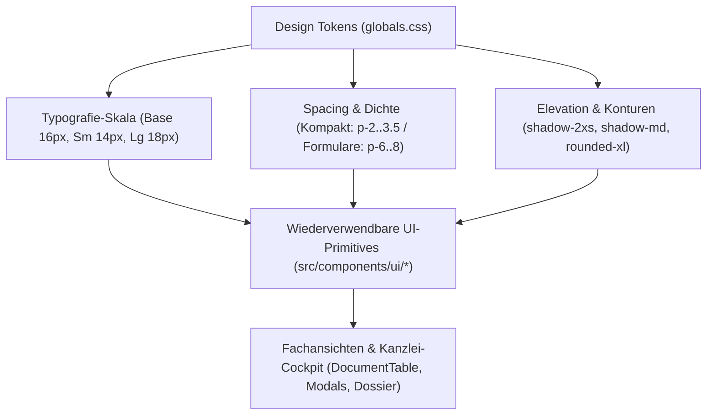

### Abzudeckende Dimensionen

1. **Typografie-Hierarchie & Zeilenhöhe (Prüfpunkt: Radikale Skalenreduktion):**
   - **Fragestellung / User-Hypothese:** Brauchen wir im Notarsystem überhaupt noch `text-sm` (14px) oder `text-xs` (12px)? Kann die Anwendung nicht nahezu durchgängig mit souveränen `text-base` (16px) als Mindestgröße arbeiten (wie moderne iPadOS- / macOS- und LegalTech-Oberflächen), um maximale Lesbarkeit bei Akteneinsicht und Urkundenprüfung zu garantieren?
   - Evaluation, ob `text-sm` und `text-xs` vollständig eliminiert oder ausschließlich auf rein dekorative Zähler beschränkt werden können.
   - Standard: `text-base` (16px) als primäre, kompromisslose Basisschrift für Fließtext, Tabellen, Formulare und Menüpunkte.
   - Headings: `text-lg`, `text-xl`, `text-2xl`, `text-3xl` mit sauberem Zeilenrhythmus (`leading-tight`) und dezentem Tracking.

2. **Abstands- & Rhythmus-Skala (Spacing & Density):**
   - Standardisierte Padding- und Margin-Stufen:
     - Kompakte Menüs & Overlays: `px-3.5 py-2` bis `px-4 py-3`.
     - Kanzlei-Karten & Dialoge: `p-6` bis `p-8`.

3. **Elevation & Schatten:**
   - Definierte Schatten- und Blur-Tokens: `shadow-2xs` für interaktive Trigger, `shadow-md` für Dropdowns/Popovers und `shadow-2xl` + `backdrop-blur-md` für Modals.

4. **Radien & Konturen:**
   - Konsistente Eckenradien: `rounded-lg` für Controls & Buttons, `rounded-xl`/`rounded-2xl` für Cards und Dialoge mit semantischer Grenzlinien-Kontrastierung (`border-border`).

### Geplante Aufgaben

- [ ] **Typografie-Refactoring & Skalen-Bereinigung:** Untersuchung und Erprobung des Verzichts auf `text-sm` und `text-xs` zugunsten einer durchgängigen `text-base`-Ergonomie (16px Mindestgröße).
- [ ] **Audit der bestehenden CSS-Tokens:** Bestandsaufnahme aller CSS-Variablen in `src/app/globals.css`.
- [ ] **Harmonisierung der Primitives:** Abgleich aller Basiskomponenten in `src/components/ui/` (`Input`, `Button`, `Card`, `ConfirmDialog`, `StatusBadge`) gegen die Enterprise-Spezifikation.
- [ ] **Overlay- & Menü-Standard:** Überprüfung aller Dropdown- und Popover-Menüs im Kanzlei-Dashboard auf Einhaltung der Mindestbreiten (`w-96`) und Schriftgrößen.
- [ ] **A11y- und Kontrastprüfung:** Validierung von Kontrastverhältnissen (WCAG AAA/AA) im Dark- und Light-Mode.

---

## 17. Storybook Component Workbench & Living Styleguide (Benchmark: GitHub Primer, Radix UI & Supabase UI)

- **Priorisierung:** Nachgelagertes Developer-Experience- und QA-Modul (optimale Ergänzung zu Modul 16 „Enterprise Styling & Design Tokens“).
- **Ziel:** Isolierte Entwicklungs- und Dokumentationsumgebung für alle Kanzlei-UI-Primitives (`src/components/ui/*`) und zusammengesetzten Notar-Dossier-Komponenten.
- **Ausgangslage:** UI-Komponenten werden bisher ausschließlich im Kontext laufender Next.js-Routen, Server-Sessions und voller Fach-Views entwickelt. Randfälle, Barrierefreiheit (a11y) und der geforderte 4-Zustände-Quadrant (_Empty_, _Loading/Skeleton_, _Error/Retry_, _Mutating/Pending_) lassen sich im vollen App-Kontext nur mit manuellem Aufwand reproduzieren.
- **Industrie-Referenz:**
  - **GitHub Primer ViewComponent / Storybook:** Reines Katalogisieren wiederverwendbarer Design-Tokens und atomarer Primitives.
  - **Radix UI & Shadcn Registry:** Saubere Trennung von Headless-Logik und Theme-Tokens mit interaktiven Controls.
  - **Supabase UI / Dashboard System:** Living Styleguide mit Accessibility-Addon und Dark-/Light-Mode Umschaltung.

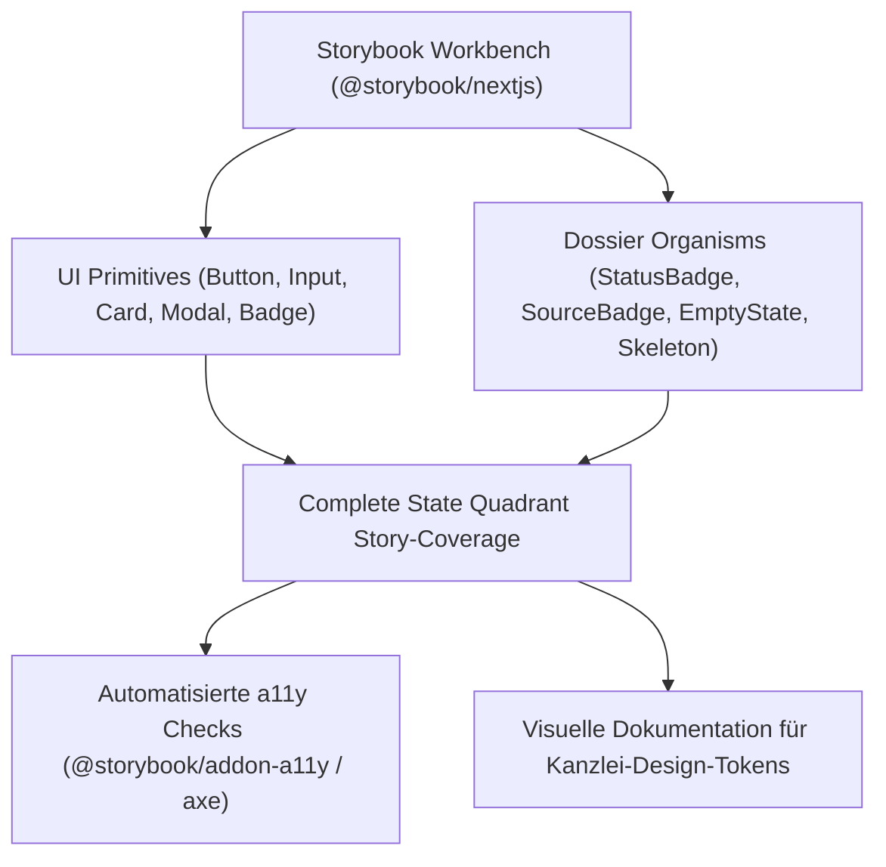

### Kernfunktionen & Mehrwerte

1. **Garantie des Complete State Quadrant (Invariante gem. AGENTS.md):**
   - Jede asynchrone Komponente erhält definierte Story-Zustände:
     - _Empty State_ (mit Notar-CTA)
     - _Loading State_ (Accessible Skeletons ohne Layout Shifts)
     - _Error State_ (inkl. Retry-Trigger)
     - _Mutating/Pending State_ (Disabled Controls & Spinners)
2. **Automatisierte Accessibility-Prüfung (a11y):**
   - Integration von `@storybook/addon-a11y` (Axe Core Engine) zur automatischen Validierung von WCAG 2.1 AA/AAA Kontrasten, Tastaturfokus und Screenreader-Labels.
3. **Theme & Skalierungs-Matrix:**
   - Direktes Umschalten zwischen Light- und Dark-Theme sowie Visualisierung der `text-base` (16px) Mindestskala und Viewport-Breiten.

### Geplante Aufgaben

- [ ] **Storybook Setup:** Installation von Storybook für Next.js (`@storybook/nextjs`) mit Tailwind CSS v4 / PostCSS-Integration.
- [ ] **Theme- & Font-Decorator:** Einbindung der Kanzlei-Theme-Provider und Schriftarten in `.storybook/preview.ts`.
- [ ] **Core Primitives Coverage:** Stories für alle atomaren UI-Bausteine in `src/components/ui/` (`Button`, `Input`, `Card`, `ConfirmDialog`, `StatusBadge`).
- [ ] **State-Quadrant Stories:** Dokumentation von Loading-, Error- und Empty-States für Kanzlei-Dossier-Komponenten.
- [ ] **Accessibility-Pipeline:** Aktivierung des `@storybook/addon-a11y` zur automatischen Prüfung auf Barrierefreiheit im CI/CD-Prozess.

---

## 18. Promptfoo Evaluation Matrix & Web-Dashboard (Benchmark: Enterprise LLMOps)

- **Priorisierung:** Vertiefendes Qualitäts- und Verifikations-Modul (Erweiterung zu Roadmap Phase A.4 / A.5).
- **Ziel:** Visuelle Matrix-Gegenüberstellung verschiedener Prompt-Varianten und LLM-Modelle (Gemini 3.8 Flash vs. Claude 3.5 Sonnet vs. GPT-4o) im interaktiven Web-Dashboard zur Vermeidung von Regressionen bei Prompt-Änderungen.
- **Ausgangslage:** Unser In-Repo-Evaluations-Runner (`scripts/eval-pipeline.ts`) liefert bereits alle Kern-Metriken (P50–P99 Latenz, Ground-Truth-Genauigkeit, Token-Ökonomie). Für die Zusammenarbeit im Team und iterative Prompt-Verfeinerungen fehlt jedoch ein grafischer Side-by-Side-Vergleich, der Prompt-Variationen transparent nebeneinander darstellt.
- **Industrie-Referenz:**
  - **Promptfoo Open-Source:** De-facto Standard im Node/TypeScript-Ökosystem für deterministisches Prompt-Testing und LLM-Evaluationen.
  - **Braintrust / Langfuse:** Enterprise-Tracing und Model-Graded Evaluations.

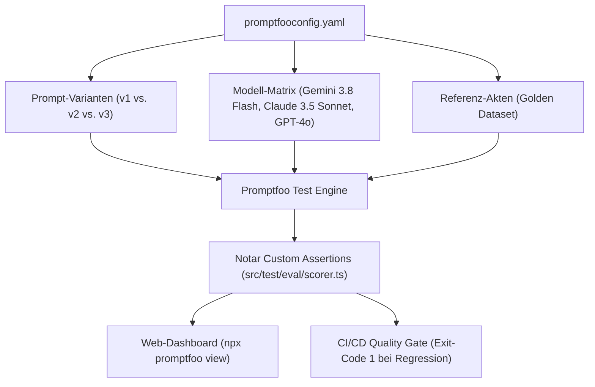

### Kernfunktionen & Mehrwerte

1. **Visueller Side-by-Side Vergleich (`npx promptfoo view`):**
   - Farbige Matrix aller 5 Referenzakten mit direkter Ansicht von Prompt-Diffs, Token-Verbräuchen und Antwortzeiten.
2. **Multi-Modell Benchmarking:**
   - Gleichzeitige Ausführung desselben Testfalls gegen verschiedene Provider, um Qualität und Wirtschaftlichkeit direkt abzuwägen.
3. **Wiederverwendung unserer Notar-Infrastruktur:**
   - 100 % nahtlose Weiternutzung unserer Zod-Schemas, 10-Pflichtfelder-Regeln und mathematischen Guardrails als TypeScript-Assertions in Promptfoo.
4. **Hermetischer Datenschutz (§ 203 StGB):**
   - Läuft vollständig lokal ohne SaaS-Account oder Datenabfluss an Drittanbieter.

### Geplante Aufgaben

- [ ] **Promptfoo Setup:** Installation von `promptfoo` als Dev-Dependency (`npm i -D promptfoo`).
- [ ] **Konfigurationsdatei:** Anlegen von `promptfooconfig.yaml` mit Verknüpfung zu `src/test/eval/golden-dataset.ts`.
- [ ] **Custom Assertion Adapter:** Kapselung von `scoreDossierAgainstGroundTruth()` aus `src/test/eval/scorer.ts` als wiederverwendbare Promptfoo-Assertion.
- [ ] **Multi-Provider Testmatrix:** Konfiguration von Provider-Endpunkten für Gemini 3.8 Flash und Claude 3.5 Sonnet.
- [ ] **NPM-Skripte:** Hinzufügen von `"eval:promptfoo": "promptfoo eval"` und `"eval:view": "promptfoo view"` in `package.json`.
- [ ] **CI/CD Integration:** Einbindung in die GitHub Actions / Husky Quality Gates als optionaler Regression-Check.
