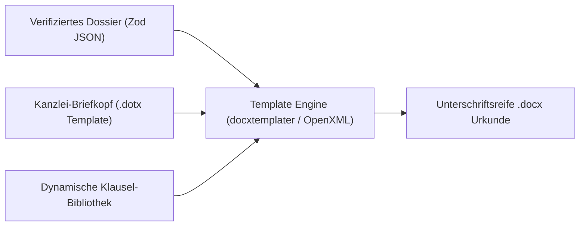

# Architektur-Roadmap Additions & Backlog

> **Kontext:** Ergänzende Module, optionale Features und nachgelagerte Bausteine aus der primären Architektur-Roadmap ([ARCHITECTURE_ROADMAP.md](file:///Users/oguz/Desktop/Dev/notar-partner-prototyp-copy/ARCHITECTURE_ROADMAP.md)).

---

## 1. Word-Urkunden-Engine (Template & OpenXML Pipeline)

- **Priorisierung:** Nachgelagertes Backlog / optionaler Schritt (im Kernfokus steht primär die rechtssichere Prüfung, Validierung, Auditierung und Datenaufbereitung).
- **Ziel:** 100 % unterschriftsreife Word-Dokumente (`.docx`) auf Kanzlei-Briefkopf ohne Copy-Paste-Fehler.
- **Ausgangslage:** Notare verlesen im Beurkundungstermin üblicherweise Microsoft Word. Statische PDF-Exporte sind für Kanzleien im Termin unbrauchbar.

### Kernfunktionen

- **Bedingte Klausel-Injektion (Conditional Logic):**
  - Z. B. Barzahlung vs. Finanzierung: Automatischer Einschub der Belastungsvollmacht und Zwangsvollstreckungsunterwerfung (§ 800 ZPO).
- **Typografische Kanzlei-Standards:**
  - Saubere Verlese-Absätze, geschützte Leerzeichen bei Geldbeträgen (`150.000,00 €`), Einrückungen und Paragraphen-Nummerierung.
- **Multi-Dokumenten-Set:**
  - Erzeugung des gesamten Pakets auf Knopfdruck: Haupturkunde, Vollmachten, Belehrungsanhang.

### Geplante Aufgaben

- [ ] Kaufvertrag-Template mit OpenXML / docxtemplater auf Kanzlei-Layout
- [ ] Datenbindung aus dem verifizierten Dossier (Parteien, Grundbuch, Kaufpreis, Belastungen)
- [ ] Download-Aktion im Cockpit
