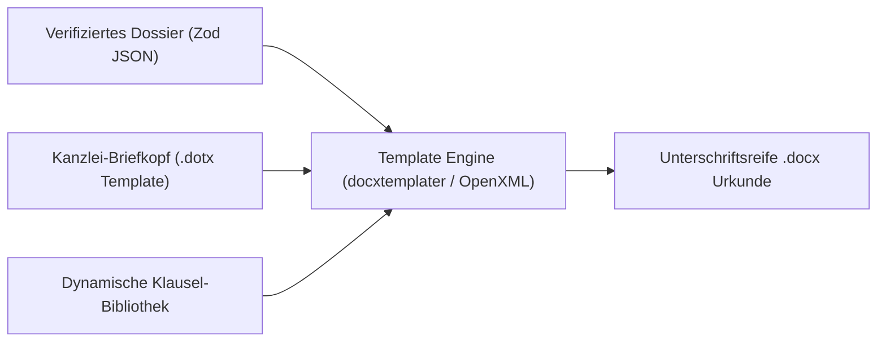
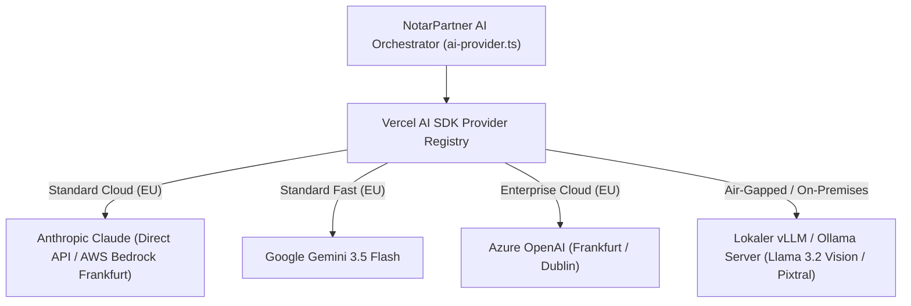
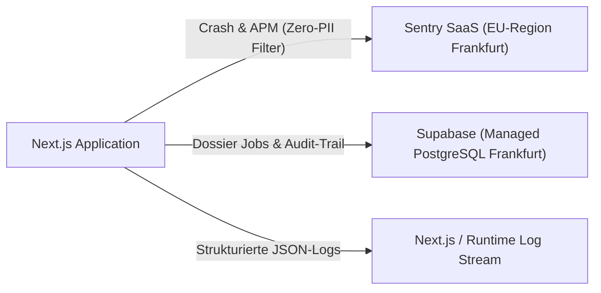
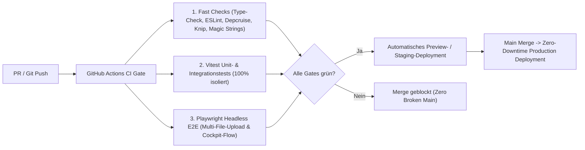
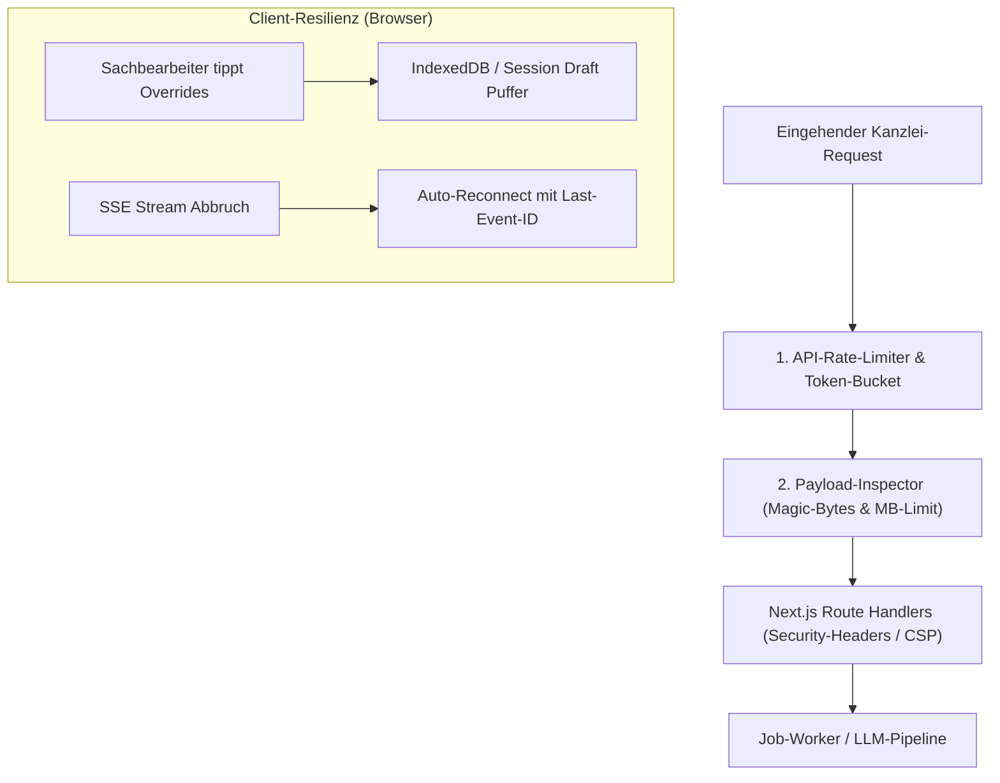

# Architektur-Roadmap Additions & Backlog

> **Kontext:** Ergänzende Module, optionale Features und nachgelagerte Bausteine aus der primären Architektur-Roadmap ([ARCHITECTURE_ROADMAP.md](./ARCHITECTURE_ROADMAP.md)).

---

## 1. Word-Urkunden-Engine (Template & OpenXML Pipeline)

- **Priorisierung:** Nachgelagertes Backlog / optionaler Schritt (im Kernfokus steht primär die rechtssichere Prüfung, Validierung, Auditierung und Datenaufbereitung).
- **Ziel:** 100 % unterschriftsreife Word-Dokumente (`.docx`) auf Kanzlei-Briefkopf ohne Copy-Paste-Fehler.
- **Ausgangslage:** Notare verlesen im Beurkundungstermin üblicherweise Microsoft Word. Statische PDF-Exporte sind für Kanzleien im Termin unbrauchbar.

### Kernfunktionen

- **Bedingte Klausel-Injektion (Conditional Logic):**
  - Z. B. Barzahlung vs. Finanzierung: Automatischer Einschub der Belastungsvollmacht und Zwangsvollstreckungsunterwerfung (§ 800 ZPO).
- **Typografische Kanzlei-Standards:**
  - Saubere Verlese-Absätze, geschützte Leerzeichen bei Geldbeträgen (`150.000,00 €`), Einrückungen und Paragraphen-Nummerierung.
- **Multi-Dokumenten-Set:**
  - Erzeugung des gesamten Pakets auf Knopfdruck: Haupturkunde, Vollmachten, Belehrungsanhang.

### Geplante Aufgaben

- [ ] Kaufvertrag-Template mit OpenXML / docxtemplater auf Kanzlei-Layout
- [ ] Datenbindung aus dem verifizierten Dossier (Parteien, Grundbuch, Kaufpreis, Belastungen)
- [ ] Download-Aktion im Cockpit

---

## 2. Multi-LLM Provider-Adapter (AWS Bedrock / Azure / vLLM)

- **Priorisierung:** Nachgelagertes Backlog / optionaler Enterprise-Schritt (aktuell sind Google Gemini und Anthropic Claude via Vercel AI SDK produktionsbereit angebunden).
- **Ziel:** Vollständige Unabhängigkeit von einzelnen US-Cloud-Endpunkten, Unterstützung von EU-Only Cloud Tenants (AWS Bedrock Frankfurt, Azure EU Data Boundary) sowie On-Premises-Infrastruktur.
- **Ausgangslage:** In bestimmten Kanzleiumgebungen (z. B. Großkanzleien, Bundeswehr-/Sicherheitsliegenschaften oder bei Mandaten mit höchsten Geheimhaltungsvorschriften) ist der Einsatz von Public APIs untersagt.

### Kernfunktionen

- **Dynamisches Provider-Routing:**
  - Konfigurierbare Endpunkte je Tenant über Umgebungsvariablen oder Kanzlei-Settings.
- **Zero-Code Switching:**
  - Standardisierte Schnittstelle über das Vercel AI SDK (`LanguageModel`), sodass Ingestion (`pipeline.ts`) und Reconciler völlig provider-agnostisch bleiben.
- **On-Premises Vision Fallback:**
  - Anbindung von lokal gehosteten OpenAI-kompatiblen Endpunkten (`baseURL` Konfiguration für vLLM/Ollama).

### Geplante Aufgaben

- [ ] AWS Bedrock Provider-Integration (`@ai-sdk/amazon-bedrock`)
- [ ] Azure OpenAI Provider-Integration (`@ai-sdk/azure`)
- [ ] Lokaler vLLM/Ollama Adapter via OpenAI-kompatibler Schnittstelle
- [ ] Tenant-spezifische Provider-Auswahl im Kanzlei-Profil

---

## 3. Zero-Data-Retention (ZDR) Vertragskonfiguration (Cloud Contractual)

- **Priorisierung:** Nachgelagertes Backlog / vertraglich-organisatorischer Schritt (ergänzend zu den technischen Hash- und Audit-Trail-Mechanismen aus Phase C.1).
- **Ziel:** Vollständiger Ausschluss der Speicherung sensibler Mandantendaten bei externen LLM-Providern zur Einhaltung von § 203 StGB und DSGVO.
- **Ausgangslage:** Standard-Cloud-APIs führen standardmäßig ein 30-tägiges Abuse-Monitoring-Logging durch, was für das notarielle Berufsgeheimnis ohne gesonderte Vereinbarung unzulässig ist.

### Kernanforderungen & Aufgaben

- [ ] Abschluss von Business Associate Agreements (BAA) / Zero-Data-Retention-Vereinbarungen mit Anthropic (0 Tage Logging)
- [ ] Konfiguration von Enterprise-ZDR für Google Cloud Vertex AI / AWS Bedrock (Region Frankfurt / EU-Only)
- [ ] Automatisierte Audit-Prüfung der API-Header auf ZDR-Compliance vor Übermittlung von Urkundeninhalten

---

## 4. Kanzlei-Observability, Crash-Reporting & Metriken (Zero-Overhead & Production-Ready)

- **Priorisierung:** Schlankes Fundament für den Produktivbetrieb (ergänzend zum bestehenden juristischen Audit-Trail gem. § 17 ff. BeurkG).
- **Ziel:** 100 % Industrie-Standard bei **minimaler betrieblicher Komplexität** („Boring Architecture“): Keine selbst gehosteten Monster-Cluster (wie ClickHouse/Redis/MinIO), sondern bewährte, wartungsfreie Managed-Lösungen mit strikter Einhaltung des Berufsgeheimnisses (§ 203 StGB).

### Kernfunktionen

1. **Error-Tracking & APM via Managed Sentry (EU-Region Frankfurt):**
   - Offizielles `@sentry/nextjs` SDK für Backend-API-Routen und Client-Fehler.
   - **Strikte § 203 StGB / Zero-PII Konfiguration:** Client- und Server-Filter (`beforeSend`), die Dateiinhalte, Klarnamen und sensible Parameter restlos unkenntlich machen, bevor Exceptions übertragen werden.
   - Sofortige Alerts bei echten Runtime-Crashes oder API-Timeouts.
2. **LLM-Telemetrie via Vercel AI SDK Standard:**
   - Nutzung der integrierten OpenTelemetry-Hooks des Vercel AI SDK (`experimental_telemetry`).
   - Strukturierte JSON-Logs für jeden Pipeline-Lauf (Dauer, Token-Verbrauch, Modelltyp, Stage) direkt im Plattform-Logstream – ganz ohne zusätzlichen Serverbetrieb.
3. **Health-Check & Uptime-Monitoring:**
   - Schlanke Route `/api/health` zur Prüfung der Verfügbarkeit von Supabase (DB-Ping) und API-Konfiguration für externe Uptime-Checks (z. B. Better Uptime / Uptime Kuma).

### Geplante Aufgaben

- [ ] `@sentry/nextjs` Integration mit EU-Endpunkt
- [ ] PII-Scrubber in `sentry.server.config.ts` zur Absicherung des Berufsgeheimnisses
- [ ] Aktivierung der Vercel AI SDK Telemetrie in `pipeline.ts`
- [ ] Health-Check Endpunkt `/api/health` mit DB-Ping

---

## 5. Automatisierte CI/CD- & Release-Pipeline (GitHub Actions)

- **Priorisierung:** Nachgelagertes Backlog / DevOps-Fundament für Produktivüberführung.
- **Ziel:** Garantierte Ausfallsicherheit und Regression-Schutz bei jedem Release durch automatisierte Quality-Gates, Headless-E2E-Tests und Zero-Downtime-Deployments.
- **Ausgangslage:** Das Projekt verfügt bereits über strenge lokale Pre-Commit- und Check-Skripte (`npm run check`, `npm test`), jedoch existiert noch keine Remote-Pipeline in GitHub Actions, die Branches vor dem Merge unabhängig auf CI-Servern validiert und automatisch deployt.

### Kernfunktionen

1. **Automatisierte PR-Gates (Continuous Integration):**
   - **Lint & Static Architecture:** Parallelisierte Ausführung von `npm run type-check`, `npm run lint`, `npm run depcruise`, `npm run knip`, `npm run audit:magic-strings` und `npm run audit:duplication`.
   - **Unit- & Integrations-Matrix:** Vollständiger Lauf aller Vitest-Suiten inklusive Mocking externer KI-APIs.
   - **Headless Playwright E2E:** Automatisches Hochfahren des Next.js-Testservers und Durchführen der Smoke- und Drag-and-Drop-Workflows im Headless-Chromium.
2. **Datenbank-Migrationen & Schema-Prüfung:**
   - Automatische Validierung neuer Supabase- / PostgreSQL-Migrationen (`audit_logs`, `dossier_jobs`) in einer isolierten Test-DB vor dem Release.
3. **Continuous Deployment (CD) & Multi-Container-Orchestrierung:**
   - Automatisches Preview-Deployment für jeden Pull Request zur visuellen Abnahme von Notariats-UI-Änderungen.
   - **Duale Prozess-Architektur (Web + Worker):** Zero-Downtime Rollout auf Produktivserver (Dokploy / Docker Compose / K8s).
     - `web`: Next.js Server (`npm run start`) für Nutzer-Interaktion und schnelle HTTP-Responses (`202 Accepted`).
     - `worker`: Autonomer Hintergrund-Daemon (`npm run worker`), der 24/7 PENDING Jobs abarbeitet und Zombie-Sweeper betreibt.
   - Automatische Generierung des optimierten Multi-Stage `Dockerfile` und `docker-compose.yml`.

### Geplante Aufgaben

- [ ] Multi-Stage `Dockerfile` (Node.js LTS, Runner-Separation) & `docker-compose.yml` (Web + Worker-Service)
- [ ] `.github/workflows/ci.yml` für automatische PR-Validierung (`check`, `test`, `build`)
- [ ] `.github/workflows/e2e.yml` für Playwright-Tests mit Browser-Caching
- [ ] Supabase CLI GitHub Action zur automatischen Prüfung von DB-Migrationen
- [ ] Konfiguration von Branch-Protection-Rules (Bedingung: Alle CI-Checks müssen bestehen vor Merge)
- [ ] CD-Deployment-Workflow für Dokploy / Docker (Staging & Production)

---

## 6. Production Hardening, API-Schutz & Kanzlei-Resilienz

- **Priorisierung:** Sicherheits- und Betriebshärtung für den ununterbrochenen Kanzleialltag.
- **Ziel:** Schutz vor DoS-/Kosten-Explosion, Eliminierung von Datenverlusten bei Netzwerkunterbrechungen und Einhaltung notarieller Aufbewahrungs- und Löschfristen (DONot).

### Kernfunktionen

1. **API-Rate-Limiting & Kostenkontrolle:**
   - Token-Bucket / Sliding-Window-Algorithmus (z. B. via Upstash Redis oder In-Memory-Bucket) für `/api/analyze` und `/api/jobs`.
   - Schutz vor Skript-Schleifen, versehentlichen Doppel-Submits und DoS-Angriffen, die teure multimodale LLM-Tokens verbrauchen.
2. **Payload-Schutz & MIME-Type Magic-Byte-Prüfung:**
   - Explizite Server-Constraints für Body-Größen vor dem Memory-Heap (Verhinderung von Node.js OOMs bei Base64-Payloads).
   - Validierung der binären Datei-Header (Magic Bytes) via `file-type`, um das Einschleusen manipulierter PDFs oder Skripte serverseitig zu blockieren.
3. **HTTP-Sicherheits-Header & Content Security Policy (CSP):**
   - Konfiguration strikter HTTP-Header in `next.config.ts`: `Content-Security-Policy`, `X-Frame-Options: DENY`, `Strict-Transport-Security (HSTS)` und `X-Content-Type-Options: nosniff`.
4. **Client-Draft-Persistence (Verbindungsabbruch-Schutz):**
   - Lokaler Draft-Puffer im Browser (`IndexedDB` oder `sessionStorage`) für `StatusOverrideReasonModal`.
   - Wenn während der Eingabe einer ausführlichen Begründung (§ 17 BeurkG) das WLAN abbricht, bleibt der Text erhalten und geht nicht verloren.
5. **Resilientes SSE-Streaming mit `Last-Event-ID`:**
   - EventSource-Reconnection mit Exponential Backoff.
   - Übermittlung des Headers `Last-Event-ID`, damit der Client bei temporärem Verbindungsabriss an der exakt letzten verarbeiteten Stage wieder aufsetzt, ohne den Job neu zu triggern.
6. **Notarielle Lösch- & Aufbewahrungsfristen (DONot / DSGVO):**
   - Automatisierte Datenbereinigung und Aktenvernichtung nach Ablauf der gesetzlichen Aufbewahrungsfristen (§ 5 Abs. 4 DONot: 5/10/30 Jahre).
   - Kryptografische Vernichtung archivierter Dokument-Payloads bei Erhalt des revisionssicheren Audit-Hashes.

### Geplante Aufgaben

- [ ] Rate-Limiting Middleware für `/api/analyze` und `/api/jobs`
- [ ] Magic-Byte-Validierung & Upload-Stream-Begrenzung im API-Layer
- [ ] Security-Header-Konfiguration (`headers()` in `next.config.ts`)
- [ ] Lokale Draft-Sicherung im `StatusOverrideReasonModal`
- [ ] `Last-Event-ID`-Unterstützung in `create-sse-stream.ts` und Client-Hooks
- [ ] Retention- und Lösch-Skript für Altdaten gem. DONot
