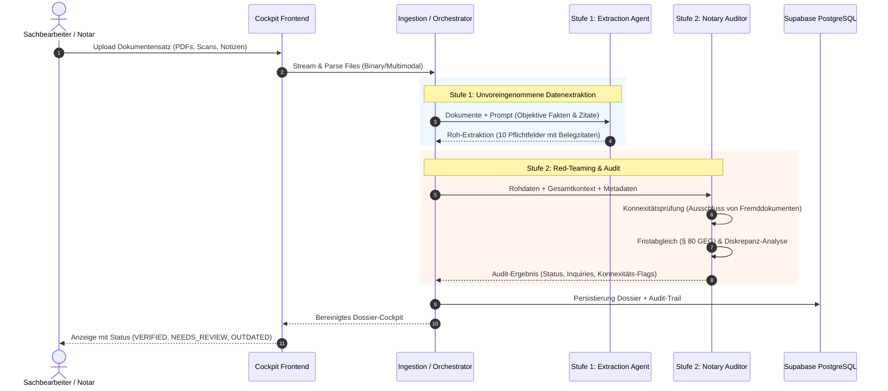

# Notizen zur Abgabe: Notarielle Urkunden-Zuarbeit

> **Kontext:** Dieser Prototyp automatisiert die Vorbereitung notarieller Urkunden (Immobilienkaufverträge & Gesellschaftsrecht) aus heterogenen Dokumentensätzen mit lückenlosem Audit-Trail und Human-in-the-Loop.

---

## 1. Getroffene Annahmen

1. **Human-in-the-Loop & Assistenzcharakter (Keine Rechtsberatung):** Die KI trifft keine materiell-rechtlichen Wertungen (BNotO/BRAO-Konformität). Alle extrahierten Daten dienen rein der Zuarbeit. Bei Zweifeln gilt: _Lieber `NEEDS_REVIEW` mit Begründung als trügerische Scheinsicherheit (`VERIFIED`)_.
2. **Objektive Belegebene & Audit-Trail:** Jede Angabe wird strikt mit Fundstelle (`fileName`, `pageNumber`, `snippet`) belegt. Informelle Vermerke (z. B. Makler-Notizen) überschreiben Bestandsdokumente nicht blind, sondern werden historisiert und als Klärungsbedarf markiert.
3. **Datenschutz & Vertraulichkeit als K.O.-Kriterium:** Keine echten Mandantendaten im Repo. Einsatz DSGVO-orientierter Infrastruktur (Supabase Region Frankfurt/EU; Anthropic API mit Commercial Terms ohne Modelltraining auf API-Daten). _Wichtige Kanzlei-Differenzierung:_ Im Standard-API-Tier speichert Anthropic Daten für Missbrauchs-Monitoring bis zu 30 Tage; für den produktiven Notariatsbetrieb ist daher ein Zero-Data-Retention-Agreement (ZDR) bzw. eine Vereinbarung zur Auftragsverarbeitung (AVV) zwingend gesondert zu vereinbaren. Keine persistente Speicherung von Rohdokumenten auf Drittservern.
4. **UI/UX-Reifegrad (Prototypischer Desktop-Fokus):** Die Benutzeroberfläche ist als funktionales Kanzlei-Desktop-Cockpit konzipiert, um den fachlichen Datenfluss und das Ampelsystem greifbar zu machen. Sie ist bewusst noch nicht für den produktiven Kanzleieinsatz durchgestylt („production-ready“ polished), besitzt kein voll-responsives Mobile-Layout (im Kanzleialltag wird an großen Desktop-Monitoren gearbeitet) und verzichtet auf aufwendige Micro-Interactions oder Custom-Stylings.

---

## 2. Wichtigste Entscheidungen & Trade-offs

### Evolution zum 2-stufigen Agentic Workflow (Evaluator-Optimizer)

- **Phase 1 (Single-Pass Baseline):** Ursprünglich wurde ein einziger Prompt für Extraktion und Plausibilisierung genutzt. Das funktionierte bereits gut, stieß jedoch an Grenzen bei subtilen Diskrepanzen, gelegentlichen Lücken in den Belegen, _Confirmation Bias_ (das Modell hinterfragte eigene Annahmen nicht) und fehlender Konnexitätsprüfung.
- **Phase 2 (Echter Agentic Workflow mit Auditor-Agent):**
  - **Stufe 1 (Extraction Agent):** Multimodale Rohdaten-Extraktion mit exakten Belegzitaten.
  - **Stufe 2 (Notary Auditor & Reconciler):** Unabhängiges Red-Teaming, das Diskrepanzen aufdeckt (z. B. Kaufpreisverhandlung 500k vs. 550k), Fristen prüft (§ 80 GEG Energieausweis) und eine Konnexitätsprüfung vornimmt.
  - _Ergebnis:_ **Spürbar präzisere Feldbelegung und Belegqualität.** Pflichtfelder werden noch lückenloser und mit treffsichereren Snippets belegt; Randfälle und Widersprüche werden deutlich verlässlicher isoliert.
  - _Trade-off:_ Höhere Token-Last für Stufe 2 vs. nochmals gesteigerte, kanzleifähige Datenqualität.

### Ablauf als Sequence Diagramm

### Weitere Trade-offs & Optimierungen:

- **Kosteneffizienz durch Delta-Auditing (Kostenkontrolle im 2-stufigen Workflow):**
  - _Kostenstruktur in der Praxis:_ Ein vollständiger 2-Stufen-Durchlauf der 6 Original-Dokumente liegt aktuell stabil bei ca. **12–13 Cent**. Die wesentlichen Einflussfaktoren für diesen Betrag:
    1. **Vision-First-Primat:** Mehrseitige PDF-Dokumente werden als hochauflösende Bild-Tokens an die Modelle übergeben, um Stempel, Siegel und handschriftliche Vermerke verlässlich zu erfassen (macht den Löwenanteil der Input-Kosten aus).
    2. **Echte Token-Abrechnung:** Da heterogene Dokumente und separate Akten jeweils neue Kontexte darstellen, erfolgt die Abrechnung nach regulären Input- und Output-Tokens.
    3. **Tiefgehende notarielle Nachforderungen in Stufe 2:** Bei komplexen heterogenen Vorgängen formuliert der Auditor-Agent mehrere präzise Nachforderungen mit juristischer Begründung (z.B. Register- und Vertretungsnachweise), was den Output-Token-Umfang gegenüber trivialen Fällen moderat erhöht.
    4. **Delta-Muster als Kostendämpfer:** Ohne das Delta-Auditing lägen die Kosten bei 16–18 Cent; durch das selektive Zurückspielen ausschließlich geänderter Felder wird der Reconciler-Output auf das Notwendige minimiert.
- **Vision-First vs. Text-Extraction bei heterogenen Urkunden (Kosten- vs. Qualitäts-Trade-off):**
  - _Hintergrund:_ Multimodale Bild-/Vision-Tokens für mehrseitige PDFs machen den Hauptteil der verbleibenden Kosten aus.
  - _Entscheidung für Vision:_ Im Notariatsbereich enthalten Akten regelmäßig eine unvorhersehbare Mischung aus maschinellem Text, handschriftlichen Randvermerken, Amtssiegeln, Stempeln und Lageplänen/Flurstücksskizzen. Eine reine Vorab-Textextraktion (z.B. per `pdf-parse`) wäre zwar kostengünstiger, birgt jedoch das unkalkulierbare Risiko, visuell eingebettete Fakten, handschriftliche Vorbehalte oder Siegelvermerke zu übersehen.
  - _Zukunftspotenzial für weitere Kostensenkung:_ Sollte in Zukunft ein hochzuverlässiges Hybrid-Verfahren zur Verfügung stehen (z. B. lokaler Layout-Classifier, der vorab prüft, ob eine PDF-Seite rein maschinenlesbaren Fließtext enthält oder handschriftliche/grafische Elemente aufweist), ließen sich reine Fließtextseiten als String übergeben und Bild-Tokens selektiv einsparen.
- **Keine verlustbehaftete PDF-Kompression (Dokumentenintegrität vor Dateigröße):**
  - _Hintergrund & Überlegung:_ Es wurde evaluiert, ob hochauflösende Scans im Browser oder Server komprimiert werden sollten, um Payload- und Token-Mengen zu reduzieren.
  - _Entscheidung dagegen:_ Bei notariellen Urkunden (verblichene Grundbuchauszüge, handschriftliche Randvermerke, Beglaubigungsvermerke, Amtssiegel) führt Bildkompression (z. B. aggressive JPEG-Artefakte oder verringerte Auflösung unter 150–200 DPI) zu verwaschenen Ziffern (`3` vs. `8`, Flurstücksnummern `124/2` vs. `124/7`) und provoziert Fehlinterpretationen oder Halluzinationen.
  - _Praxislösung:_ Dokumente werden in voller visueller Originaltreue belassen. Überschreitet eine Datei das Verarbeitungs- und API-Limit (> 32 MB), wird sie nicht stillschweigend beschädigt, sondern das System gibt eine nutzerfreundliche Kanzlei-Warnung mit konkreten Handlungsempfehlungen aus.
- **Hermetische Persistenz:** Supabase PostgreSQL als Single Source of Truth mit Row-Level Security (§ 203 StGB) und striktem Fail-Fast.

---

## 3. KI-Einsatz beim Bauen (Was funktionierte vs. Wo eingegriffen wurde)

### Was hervorragend funktioniert hat:

- **Scaffolding von Typen & Komponenten:** Schnelle Generierung modularer Zod-Validierungsschemata und barrierefreier React-Tabellen.
- **Multimodale Extraktion unstrukturierter Dokumente:** Zuverlässiges Erkennen von Tabellen in Grundbuchauszügen, Siegeln und handschriftlichen Vermerken ohne fehleranfälliges separates OCR.

### Wo manuell eingegriffen und nachjustiert werden musste:

- **Konnexitäts-Problem (Fremddokumente):** Beim Upload einer beigefügten Fremd-Gewerbeanmeldung ordnete die KI die fremde Person fälschlich als Käufer zu. _Lösung:_ Einbau einer expliziten Konnexitäts-Validierung (Matching von Parteien und Liegenschaftsdaten mit dem Vorgangskern).
- **Vermeidung suggestiver Prompts vs. Gesetzliche Prüfungsmaßstäbe:** Frühe Prompts markierten gültige Urkunden vorschnell als `OUTDATED` (z. B. Grundbuchauszüge aufgrund eines älteren Ausstellungsdatums). Ein reflexartiges Gegensteuern durch suggestive Einzelfall-Vorgaben im Prompt ("Prüfe Energieausweis nach 10 Jahren, Grundbuch nie veraltet") oder Code-Hardcoding wurde bewusst vermieden. Stattdessen wurden in Stufe 2 **abstrakte gesetzliche Prüfungsmaßstäbe verankert** (§ 80 Abs. 2 GEG für kalendarisch befristete Ausweise vs. § 21 BeurkG für unbefristete Grundbuchbestände), die objektiv begründen, warum welche Urkunde welchen Status erhält.
- **Notarielle Edge Cases & deterministische Guardrails (Erbfall, Vertretung, Teilflächen):**
  - _Eigentümeridentität vs. Erbfall (§ 35 GBO, § 21 BeurkG):_ Weicht der handelnde Verkäufer von den im Grundbuch eingetragenen Eigentümern ab (z. B. Erblasser noch eingetragen), wird der Status deterministisch auf `NEEDS_REVIEW` gesetzt und ein Erbschein bzw. Eröffnungsniederschrift nachgefordert.
  - _Register- & Vertretungsnachweise (§ 12 HGB, § 21 BNotO):_ Handelt eine juristische Person (GmbH, UG, KG), stuft das System fehlende Registerauszüge sofort als Klärungsbedarf (`NEEDS_REVIEW`) ein und verhindert Scheinsicherheit (`VERIFIED`).
  - _Teilflächenverkauf:_ Unvermessene Teilflächen erfordern zwingend den Hinweis auf amtliche Teilungsvermessung und Fortführungsnachweis.
- **Resilientes Type-Coercion & Defensive Parsing (`NotaryNumberSchema`):** LLMs liefern Zahlenwerte aus gescannten Urkunden mitunter als formatierte Strings (z. B. `"500.000,00 €"`, `"145 m²"`, `"112 kWh/(m²*a)"`). Statt Anfragen mit Zod-Typfehlern (`Expected number, received string`) abbrechen zu lassen, transformiert ein Zod-Preprocessor Währungs-, Flächen- und Einheitenzeichen sowie deutsche Tausendertrennpunkte deterministisch in gültige `number`-Werte.
- **Defensive Datumsanweisung ohne Halluzinationen:** Frühe Prompts erzwangen `JJJJ-MM-TT`, was das Modell dazu verleitete, bei nur jahres- oder monatsdatierten Alturkunden fiktive Tage zu erfinden. Der Prompt wurde defensiv auf Teilzeiträume (`JJJJ-MM`, `JJJJ` oder leer) umgestellt, ohne das Schema zu verletzen.
- **SDK-Grammar-Limits:** Bei tief geschachtelten Zod-Objekten stießen SDK-Grammatiken an Puffergrenzen; gelöst durch serverseitiges JSON-Parsing mit nachgelagertem `safeParse`.

---

## 4. Architektur-Roadmap für skalierenden Live-Betrieb

Für den Übergang von diesem Abgabe-Prototyp in einen vollintegrierten 24/7-Kanzleibetrieb wurde eine detaillierte Architektur-Spezifikation ausgearbeitet:

👉 **Ausführliche Dokumentation inkl. Mermaid-Sequenzdiagrammen & Worker-Beispielen:**  
[ARCHITECTURE_ROADMAP.md](./ARCHITECTURE_ROADMAP.md)

### Die Kernsäulen im Überblick:

1. **Qualitäts-Fundament & Kanzlei-Compliance (Test-First):**
   - Playwright E2E-Testsuite zur Simulation des gesamten Kanzlei-Workflows (Multi-Upload, Human-in-the-Loop-Overrides, barrierefreie Tastaturnavigation).
   - Revisionssicherer Kanzlei-Audit-Trail (PostgreSQL Append-Only Event-Log) und vertragliche Zero-Data-Retention (ZDR).
   - UI/UX-Polishing & Responsiveness (Überführung des funktionalen Desktop-Prototyps in ein ausgereiftes, responsives Designsystem).
2. **Provider-Flexibilität & Kostensenkung (Quick Wins – Hoher ROI):**
   - Austauschbare KI-Infrastruktur via Vercel AI SDK Core (Anthropic Claude, Azure OpenAI EU, lokale Open-Source LLMs via vLLM für Hochsicherheitsakten).
   - Hybride OCR/Vision-Pipeline (Vorab-Klassifizierung digitaler Textseiten spart sofort **60–75 % der Token-Kosten** ohne Infrastruktur-Umbau).
3. **Asynchrone Verarbeitungs-Queue (BullMQ / Redis):**
   - Löst HTTP-Timeouts (30–60 s) bei Aktenbänden von 50–200 Seiten.
   - Upload antwortet in < 250 ms mit `202 Accepted`; Entkopplung in Background-Worker mit Live-Fortschritt via Server-Sent Events (SSE).
4. **Mandantenfähigkeit (Multi-Tenancy) & Kanzlei-Isolation (§ 203 StGB):**
   - Strikte Datentrennung via PostgreSQL Row-Level Security (RLS) auf Kernel-Ebene; feingranulares Rollenmodell (Notar, Sachbearbeiter, Admin).
5. **Fachverfahren- & Notarnetz-Integration (XJustiz / XNP):**
   - Standardisierter XJustiz-Export zur medienbruchfreien Übernahme in TriNotar, NoRA, Notar 4.0 und RA-MICRO sowie Expansion auf GmbH-Gründungen & Erbscheine.
