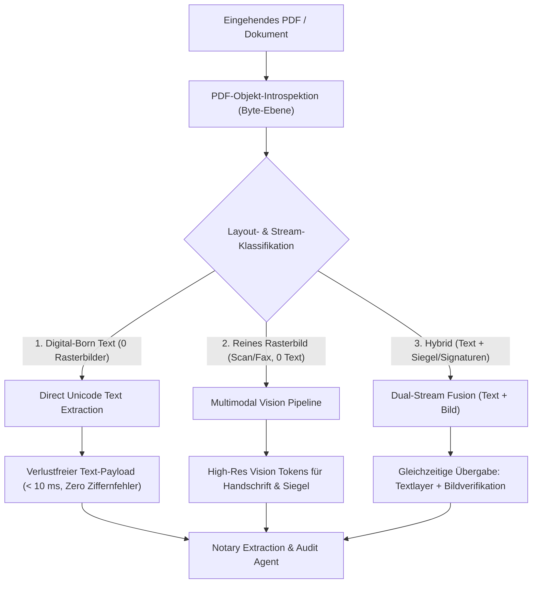

# Dual-Stream Ingestion Pipeline

> **Architektur-Spezifikation:** Verlustfreie Zeichenintegrität & Multimodal Vision  
> **Kernkomponenten:** `src/lib/files/pdf-stream-classifier.ts`, `src/lib/files/pdf-text-extractor.ts`, `src/lib/ai/pipeline.ts`

---

## 1. Problemstellung im Notariat

Im Notariat steht **absolute Zeichenpräzision (Zero OCR-Tippfehler)** an oberster Stelle:

- Fehlerhafte Ziffernfolgen bei Kaufpreisen (`1.250.000 €`), Registernummern (`HRB 20459`) oder Flurstücken (`Flur 12, Flurstück 108/4`) führen zu verheerenden Zwischenverfügungen oder Haftungsfällen.
- Gleichzeitig enthalten notarielle Urkundensätze handschriftliche Vermerke, farbige Siegel, Stempel und unvollständige Scans, die reine Text-Parser nicht erfassen können.

---

## 2. Die 3 Stream-Klassen

Eine Byte-Ebene-Introspektion des PDFs klassifiziert jede eingehende Datei deterministisch in einen von drei Modi:

1. **Digital-Born PDF (Reiner Textlayer, keine Rasterbilder):**
   - Extrahiert den Unicode-Text direkt verlustfrei (< 10 ms via `unpdf`).
   - Mathematisch ausgeschlossene Fehlinterpretationen bei sensiblen Ziffernfolgen.
   - 0 € Server-Zusatzkosten, 0 ms Kaltstart.

2. **Scans / Bildträger (Reine Bildseiten, kein Text):**
   - Multimodales Vision-Routing (Gemini Flash Vision / Claude Vision).
   - Maximales Kontextverständnis bei Handschriften, Notarsiegeln und Stempeln.

3. **Hybride Dokumente (Digitaler Text + eingescannte Siegel/Signaturen):**
   - **Dual-Stream Fusion:** Übergabe sowohl des exakten Unicode-Textlayers als auch der Bild-Payloads an das Modell mit striktem Abgleich.

---

## 3. Architektur-Status & Ausbaustufen

- **Deterministisches Zitat-Grounding via `diff-match-patch` (Implementiert):**
  Zeichengenaue Verifikation von Beleg-Snippets auf dem PDF-Textlayer zur Vermeidung von Halluzinationen (§ 17 BeurkG Provenance) mit exakter Koordinaten- und Offset-Lokalisierung.
- **Serverless Ingestion Overhaul (B.8):**
  Flache, modulare Zod-Sub-Schemas pro Dokumenttyp (Grundbuch, Energieausweis, Mietlisten) und selektives Windowing für Großakten (> 150 Seiten) bei 100 % Serverless-Kompatibilität.
