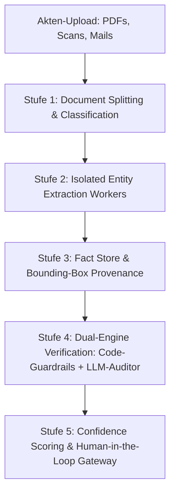

# Enterprise Legal Document Processing Architecture

## Architekturstandard für hochregulierte KI-Dokumentenverarbeitung (LegalTech & Notariat)

Dieses Dokument dient als architektonische Referenz für die Verarbeitung komplexer, heterogener Dokumentenbündel (Urkunden, Grundbücher, Verträge, Notizen) im Notariatsumfeld. Es basiert auf den erprobten Konstruktionsmustern marktführender Enterprise-LegalTech-Systeme (u. a. **Harvey AI, Robin AI, Casetext / CoCounsel, Palantir AIP, Bloomberg Law**).

---

## 1. Warum „Naive LLM-Extraktion“ in regulierten Branchen scheitert

Ein typischer Prototyp-Ansatz („Alle Akten in einen Prompt werfen, LLM soll JSON extrahieren und Gesetze prüfen“) stößt in der juristischen Praxis schnell an fundamentale Grenzen:

| Problem in der Praxis            | Ursache im KI-Modell                                                                                                                                            | Konsequenz für das Notariat                                               |
| :------------------------------- | :-------------------------------------------------------------------------------------------------------------------------------------------------------------- | :------------------------------------------------------------------------ |
| **Lost-in-the-Middle**           | Bei 30–80 Seiten Aktenumfang überliest das LLM handschriftliche Randvermerke oder tiefe Klauseln.                                                               | Haftungsrisiko (§ 19 BNotO) durch übersehene Belastungen im Grundbuch.    |
| **Rechen- & Fristenschwäche**    | LLMs sind Wahrscheinlichkeitsmodelle für Sprache, keine Taschenrechner. Bei Schaltjahren, Zinsstaffeln oder Monatsabgleichen entstehen subtile Halluzinationen. | Falsche Beurkundungsreife bei abgelaufenen Fristen (§ 80 GEG, 10 Jahre).  |
| **Fehlende optische Provenienz** | Ein reines Textzitat (`snippet: "Kaufpreis 400.000 €"`) belegt nicht die visuelle Authentizität (Siegel, Streichungen, Paraphen).                               | Notare müssen die Stelle im Originaldokument mühsam manuell nachschlagen. |
| **Monolithische Fragilität**     | Ein Parsing-Fehler oder Schema-Fehler in einem Nebenfeld (z.B. Energieausweis) lässt die gesamte Extraktion scheitern.                                          | Totalausfall des Workflows statt granularer Teilverarbeitung.             |

---

## 2. Die 5-Stufen Enterprise-Architektur

Enterprise-Systeme entkoppeln die Verarbeitung in **fünf spezialisierte, voneinander isolierte Stufen**:



---

### Stufe 1: Document Splitting, OCR & Classification (Triage-Phase)

Niemals wird eine ungeordnete Akte direkt an ein Extraktionsmodell übergeben.

- **Dokumenten-Segmentierung (Splitting):**  
  Scans enthalten oft mehrere Urkunden in einer einzigen PDF. Visuelle und textuelle Trenner (Deckblätter, Beglaubigungsvermerke, Siegel) erkennen die Schnitte.
- **Typ-Klassifikation:**  
  Jedes Dokument erhält eine exakte Typisierung:
  - `GRUNDBUCHAUSZUG` (amtlich, Höchstpriorität)
  - `KAUFVERTRAGSANGEBOT` / `ENTWURF` (parteiisch/informell)
  - `ENERGIEAUSWEIS` (technischer Nachweis)
  - `BEARBEITUNGSNOTIZ` (interne Notar-Anweisung)
- **Dual-Stream Layering:**  
  Trennung von digitalem Unicode-Textlayer (für exakte Zahlen, IBANs, Flurstücke) und visuellen PDF-Seiten-Renderings (für Siegel, Unterschriften, Streichungen).

---

### Stufe 2: Isolated Entity Extraction Workers (Map-Phase)

Statt eines monolithischen Prompts für 10 Felder arbeiten spezialisierte Worker parallel und isoliert:

- **Spezifische Bindung an Quelltypen:**
  - Der _Grundbuch-Worker_ liest **nur** Dokumente vom Typ `GRUNDBUCHAUSZUG`. Er sucht nach Blatt, Bestand, Abt. I (Eigentümer) und Abt. II/III (Lasten).
  - Der _Parteien-Worker_ gleicht Ausweise und Handelsregisterauszüge ab.
  - Der _Kaufpreis-Worker_ extrahiert Zahlen, Währungen und Zahlungsbedingungen aus dem Vertragsentwurf.
- **Vorteil:**
  1. Scheitert ein Feld (z.B. weil der Energieausweis unleserlich ist), sind alle anderen 9 Felder unberührt und gültig.
  2. Kleinerer Kontext pro Worker = maximale Aufmerksamkeit des Modells (Zero Attention Drain).

---

### Stufe 3: Fact Store & Bounding-Box Provenance (Beweiskraft)

Jeder extrahierte Wert ist kein loser String, sondern ein unteilbares **Fact-Objekt** im Fact Store:

```typescript
interface ProvenancedFact<T> {
  value: T;
  confidence: number; // 0.00 bis 1.00
  source: {
    documentId: string;
    documentType: "GRUNDBUCHAUSZUG" | "VERTRAGSENTWURF" | ...;
    pageNumber: number;
    textSnippet: string;
    // Visuelle Koordinaten auf der PDF-Seite (für 1-Klick-Auditing in der UI)
    boundingBox?: {
      x: number;
      y: number;
      width: number;
      height: number;
    };
  };
}
```

- **Notarieller Mehrwert:**  
  Klickt der Sachbearbeiter in der Benutzeroberfläche auf die Grundstücksgröße (`842 m²`), springt der integrierte PDF-Viewer auf Seite 3 des Grundbuchauszugs und hebt den Flurstückseintrag farblich hervor.

---

### Stufe 4: Dual-Engine Verification (Code-Guardrails + LLM-Auditor)

Die Trennung von deterministischer Mathematik und semantischer Rechtsauslegung:

```
┌─────────────────────────────────────────────────────────────────┐
│                    DUAL-ENGINE VERIFICATION                     │
├────────────────────────────────┬────────────────────────────────┤
│    DETERMINISTIC CODE ENGINE   │          LLM AUDITOR           │
│   (TypeScript / Postgres-RPC)  │   (Semantische Auslegung)      │
├────────────────────────────────┼────────────────────────────────┤
│ • Fristenprüfungen:            │ • Identitätsprüfung:           │
│   Ausstellungsdatum + 10 Jahre │   Ist "Erika Schmidt geb. May" │
│   < Bearbeitungsstichtag       │   identisch mit "Erika May"?   │
│ • Rechnerische Prüfungen:      │ • DNotI-Rechtsabgleich:        │
│   Monatsmiete × 12 = Jahres-   │   Liegt eine unzulässige       │
│   rohertrag? MaBV-Staffel 100% │   Veräußerungssperre vor?      │
│ • Typ- & Formatvalidierung:    │ • Widerspruchsauflösung:       │
│   Flurstücksnummer-Format,     │   Makler verlangt 500k,        │
│   Handelsregisternummer-Format │   Notiz des Notars sagt 450k.  │
└────────────────────────────────┴────────────────────────────────┘
```

> **Goldene Regel:** _Lasse niemals ein LLM rechnen, was eine einzige Zeile Programmcode fehlerfrei, sofort und kostenlos ermitteln kann._

---

### Stufe 5: Confidence Scoring & Human-in-the-Loop Gateway

Kein Rechtsdokument verlässt das System ohne definierte Freigabeschranken:

1. **Grün (Automated Pass):**  
   Konfidenz >= 0.95, amtlicher Quellbeleg liegt vor, keine mathematischen oder datumsbezogenen Diskrepanzen.
2. **Gelb (Human-in-the-Loop / Klärungsbedarf):**  
   Widersprüchliche Quellen (z.B. Kaufpreis in E-Mail weicht vom Vertragsentwurf ab), veraltete Nachweise oder fehlende Handelsregisterauszüge.  
   -> System generiert automatisch eine präzise **Nachforderung (`Inquiry`)** für die Kanzlei.
3. **Rot (Beurkundungshindernis / Blocked):**  
   Verkäufer ist nicht im Grundbuch eingetragen und Erbnachweis fehlt (§ 35 GBO); nicht befreiter Insichgeschäft-Verdacht (§ 181 BGB).

---

## 3. Roadmap: Wie wir unseren Prototyp schrittweise überführen

Wir müssen das Rad nicht komplett neu erfinden, sondern bauen das bestehende System entlang dieser 5 Stufen evolutionär aus:

- [x] **Schritt 1 (Erledigt):** Database-First SSOT für rechtliche Normen (`knowledge_documents` in PostgreSQL).
- [x] **Schritt 2 (Erledigt):** Bereinigung von Fachdaten und Paragraphen aus Prompts & TypeScript-Code.
- [ ] **Schritt 3 (Als Nächstes):** Zod-Feldvalidierung & Deterministische Guardrails (Mathematik & Datumsfristen zu 100 % in TypeScript-Code).
- [ ] **Schritt 4:** Paginierte Beleg-Provenienz & Audit-Trail-Verknüpfung (§ 17 BeurkG).
- [ ] **Schritt 5:** Hybrid Search (Vektor-Embeddings via `pgvector` + Volltextsuche `tsvector`).
