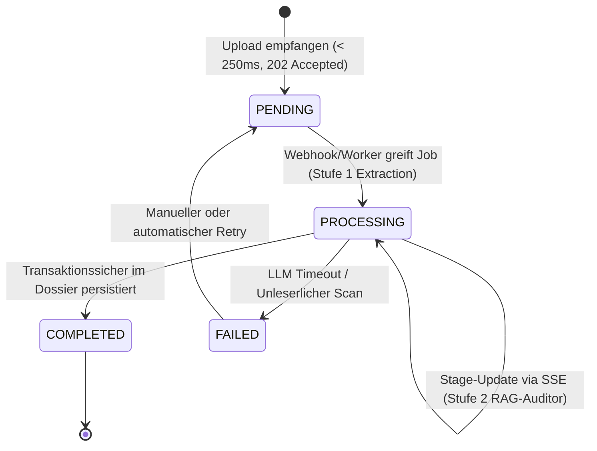
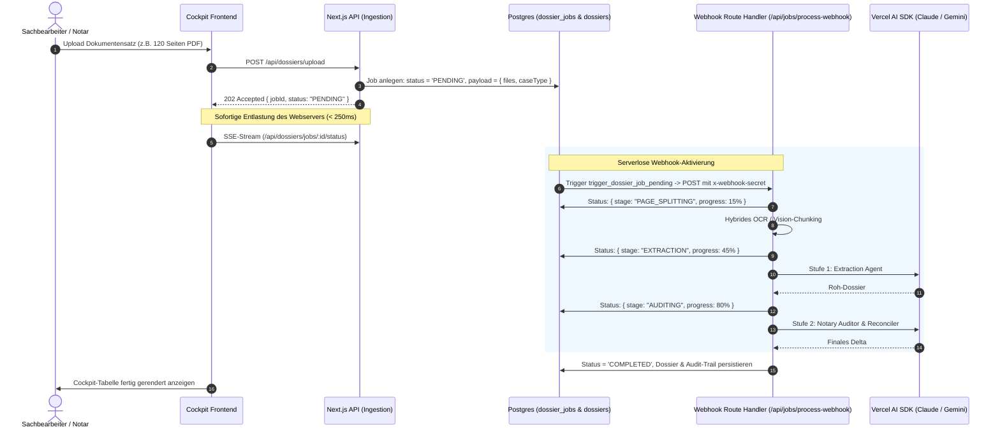

# Asynchrone Job-Orchestrierung & Webhooks

> **Architektur-Spezifikation:** Asynchrone Hintergrundverarbeitung im 24/7-Kanzleibetrieb  
> **Kernkomponenten:** `src/types/jobs.ts`, `src/lib/jobs/job-repository.ts`, `src/app/api/jobs/process-webhook/route.ts`, PostgreSQL `dossier_jobs`

---

## 1. Problemstellung im Kanzleialltag

| Problem                | Auswirkung ohne Queue (Synchron)                                                                  | Lösung mit PostgreSQL-Queue (`dossier_jobs`)                                           |
| :--------------------- | :------------------------------------------------------------------------------------------------ | :------------------------------------------------------------------------------------- |
| **HTTP-Timeouts**      | Proxies kappen Verbindungen nach 30–60 s. 100-Seiten-Lauf bricht mit `504 Gateway Timeout` ab.    | HTTP-Upload antwortet in **< 250 ms** mit `202 Accepted` (`status: PENDING`).          |
| **Tab-Schließung**     | Sachbearbeiter schließt den Browser $\rightarrow$ Lauf bricht ab, Tokens verbrannt.               | Jobs persistieren transaktionssicher in Postgres; Bearbeitung läuft entkoppelt weiter. |
| **Peak-Load & Limits** | Wenn morgens 8 Mitarbeiter gleichzeitig Akten hochladen, drohen `429 Rate Limits` oder RAM-Crash. | **Concurrency Control:** Worker greift Jobs via `FOR UPDATE SKIP LOCKED`.              |
| **Transiente Fehler**  | KI-Server überlastet (`529 Overloaded`) $\rightarrow$ Vorgang scheitert.                          | Automatischer Retry-Zähler im Job-Record mit geregeltem Backoff.                       |

---

## 2. Job-Lifecycle & Sequenz

---

## 3. Serverlose Event-Orchestrierung via Supabase Webhooks

Statt dauerhaft laufender Polling-Prozesse (`setInterval`) nutzt das System native PostgreSQL Database Webhooks:

- **Realtime Trigger:** Bei Anlage eines Jobs feuert der Trigger `trigger_dossier_job_pending` via Supabase sofort an `/api/jobs/process-webhook`.
- **Kryptografische Sicherheit:** Header `x-webhook-secret` gleicht mit `SUPABASE_WEBHOOK_SECRET` ab.
- **Orphan Sweeper:** Falls ein Serverless-Container hart abbricht, reaktiviert ein Lease-Timeout-Sweeper verwaiste Jobs automatisch.
